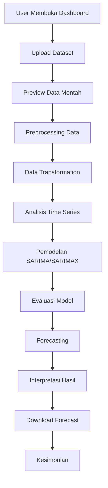
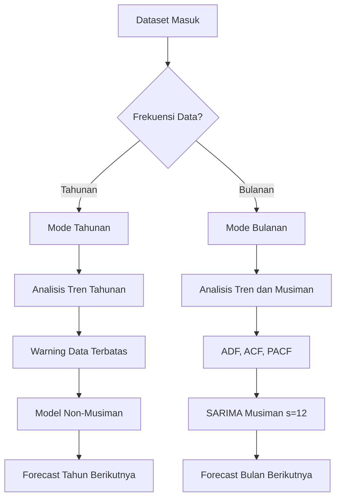
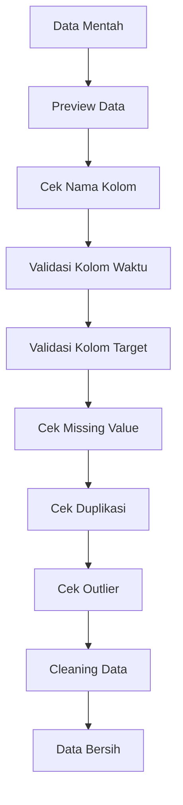
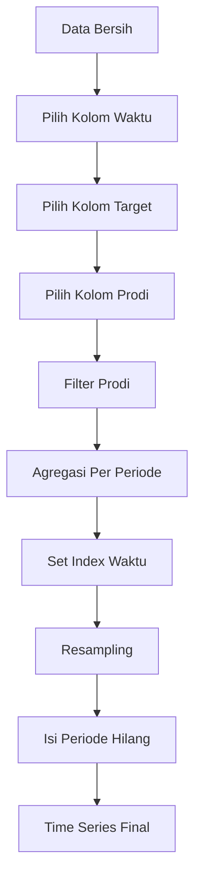
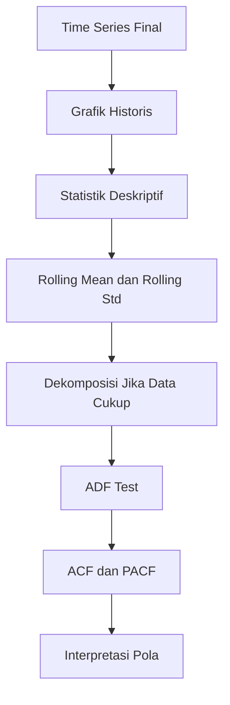
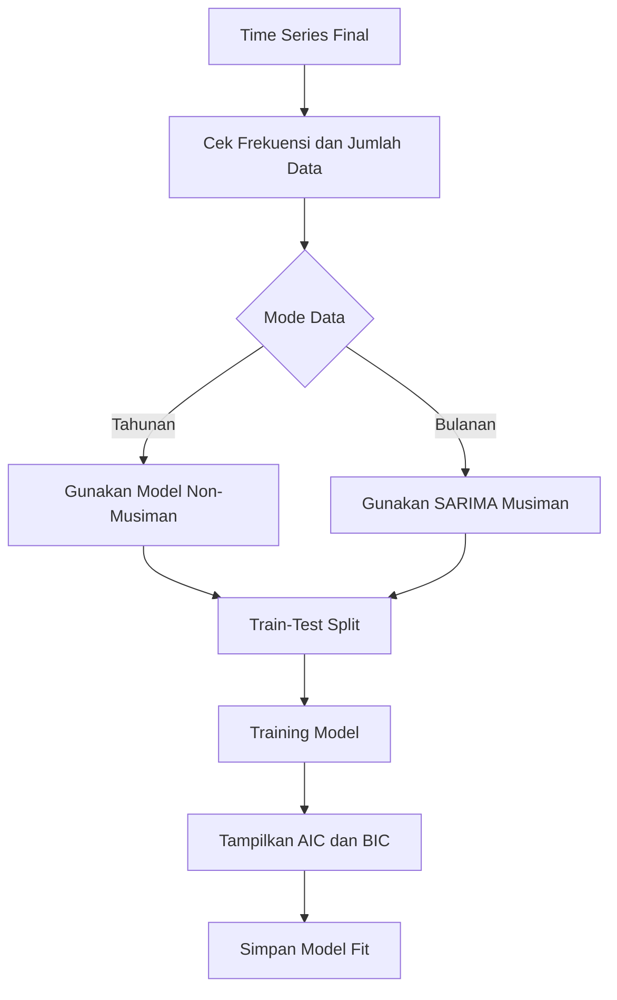
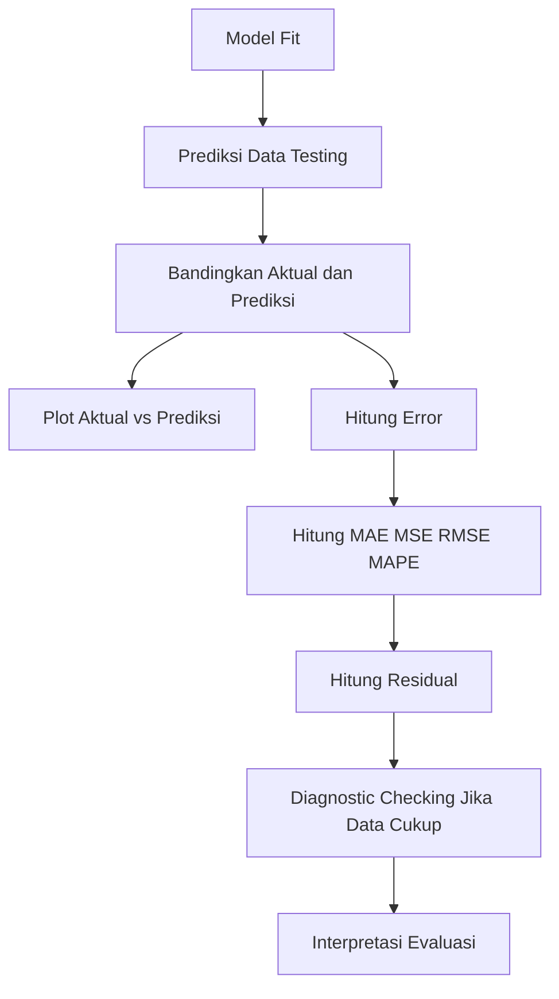
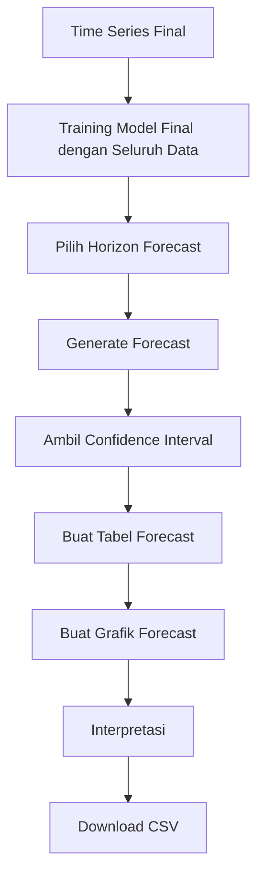

# codex.md  
# PRD Lengkap dan Spesifikasi Pengkodingan Dashboard Streamlit Forecasting Pendaftaran Mahasiswa Baru dengan SARIMA

> Dokumen ini dibuat sebagai **Product Requirements Document (PRD)** sekaligus **instruksi teknis pengembangan** untuk membangun dashboard forecasting berbasis **Streamlit** dengan metode **SARIMA/SARIMAX**.  
> Dokumen ini dapat digunakan sebagai panduan coding, panduan untuk Codex/AI coding assistant, dan acuan implementasi project tugas akhir.

---

# 1. Identitas Project

## 1.1 Nama Project

**Dashboard Forecasting Tren Minat Jurusan Mahasiswa Baru Menggunakan Streamlit dan SARIMA**

## 1.2 Konteks Project

Project ini dibuat untuk kebutuhan tugas akhir/skripsi yang bertujuan menganalisis dan memprediksi tren minat jurusan mahasiswa baru berdasarkan data historis pendaftaran mahasiswa.

Dashboard dibangun menggunakan **Streamlit** agar hasil analisis dan prediksi dapat ditampilkan secara interaktif, mudah dibaca, dan mudah dipresentasikan saat sidang.

Metode utama yang digunakan adalah **SARIMA/SARIMAX** dari library `statsmodels`.

## 1.3 Target Output

Output akhir project adalah aplikasi dashboard yang dapat:

1. membaca dataset pendaftaran mahasiswa,
2. membersihkan data,
3. mengubah data menjadi bentuk time series,
4. menganalisis pola data,
5. menjalankan model SARIMA/SARIMAX,
6. mengevaluasi performa model,
7. menghasilkan forecast,
8. menampilkan grafik dan tabel,
9. memberikan interpretasi otomatis,
10. menyediakan hasil forecast dalam format CSV.

---

# 2. Ringkasan Produk

Dashboard ini bukan hanya dashboard visualisasi biasa. Dashboard ini harus dibangun sebagai **dashboard penelitian forecasting**.

Artinya, dashboard tidak hanya menampilkan grafik pendaftar, tetapi juga menampilkan proses ilmiah dari awal sampai akhir.

Alur utama dashboard:

```text
Data Mentah
→ Preprocessing Data
→ Data Transformation
→ Analisis Time Series
→ Pemodelan SARIMA/SARIMAX
→ Evaluasi Model
→ Forecasting
→ Interpretasi
→ Kesimpulan
```

Dashboard harus menjawab pertanyaan berikut:

1. Data apa yang digunakan?
2. Bagaimana data dibersihkan?
3. Bagaimana data diubah menjadi time series?
4. Apakah data memiliki tren?
5. Apakah data memiliki pola musiman?
6. Apakah data cukup untuk SARIMA musiman?
7. Parameter model apa yang digunakan?
8. Seberapa baik hasil prediksi model?
9. Bagaimana hasil forecast periode berikutnya?
10. Apa makna hasil forecast tersebut?

---

# 3. Masalah Utama yang Harus Diselesaikan

## 3.1 Permasalahan Data

Data pendaftaran mahasiswa baru biasanya tersedia dalam bentuk rekap tahunan.

Contoh:

| Tahun | Jumlah Pendaftar |
|---:|---:|
| 2021 | 371 |
| 2022 | 587 |
| 2023 | 714 |
| 2024 | 1125 |
| 2025 | 1148 |

Data seperti ini memang sesuai dengan konteks PMB karena penerimaan mahasiswa baru dilakukan setiap tahun.

Namun dari sisi time series, data tersebut hanya memiliki **5 observasi**. Jumlah ini terlalu sedikit untuk membuktikan pola musiman SARIMA secara kuat.

Karena itu, dashboard harus mendukung dua mode:

```text
Mode Tahunan
→ digunakan untuk data rekap tahunan
→ fokus pada tren tahunan
→ model musiman tidak dipaksakan

Mode Bulanan
→ digunakan jika tersedia data tanggal/bulan pendaftaran
→ cocok untuk SARIMA musiman
→ seasonal period dapat menggunakan 12
```

## 3.2 Permasalahan Metodologi

SARIMA secara teori digunakan untuk data yang memiliki komponen musiman. Namun, jika data hanya tahunan dengan 5 titik data, maka seasonality sulit dibuktikan.

Karena itu, sistem harus jujur secara metodologi.

Dashboard tidak boleh mengklaim bahwa model SARIMA musiman sangat kuat jika data yang dipakai hanya rekap tahunan 2021–2025.

Dashboard harus menampilkan peringatan seperti:

```text
Data tahunan yang tersedia memiliki jumlah observasi terbatas. Oleh karena itu, model digunakan untuk analisis tren dan forecast awal. Untuk analisis SARIMA musiman yang lebih kuat, diperlukan data dengan frekuensi bulanan atau mingguan.
```

## 3.3 Permasalahan Dashboard

Dashboard yang hanya menampilkan data historis belum cukup.

Dashboard harus memiliki perhitungan model yang benar:

```text
Time Series Final
→ Train-Test Split
→ Training Model
→ Prediksi Testing
→ Evaluasi Error
→ Forecast Masa Depan
→ Interpretasi
```

Jika hanya menampilkan tabel dan grafik data, maka dashboard belum dapat disebut dashboard forecasting SARIMA.

---

# 4. Tujuan Produk

Tujuan produk:

1. Membuat dashboard interaktif untuk analisis tren pendaftaran mahasiswa baru.
2. Menyediakan proses preprocessing data yang jelas.
3. Mengubah data pendaftaran menjadi data deret waktu.
4. Menampilkan analisis time series seperti tren, rolling mean, ADF Test, ACF, dan PACF.
5. Menjalankan model SARIMA/SARIMAX secara adaptif sesuai bentuk data.
6. Mendukung data tahunan dan data bulanan.
7. Memberikan warning metodologis jika data terlalu sedikit.
8. Mengevaluasi model menggunakan MAE, MSE, RMSE, MAPE, AIC, dan BIC.
9. Menampilkan hasil forecast dalam grafik dan tabel.
10. Membantu pengguna memahami hasil prediksi melalui interpretasi otomatis.

---

# 5. Target Pengguna

## 5.1 Mahasiswa/Peneliti

Mahasiswa menggunakan dashboard untuk:

- mengolah data pendaftaran mahasiswa,
- membuktikan proses forecasting,
- mempersiapkan demo sidang,
- menjelaskan alur penelitian secara runtut.

## 5.2 Dosen Pembimbing

Dosen pembimbing menggunakan dashboard untuk:

- mengecek kelayakan metode,
- melihat proses preprocessing,
- mengevaluasi hasil model,
- memberi masukan terhadap interpretasi.

## 5.3 Dosen Penguji

Dosen penguji menggunakan dashboard untuk:

- memeriksa apakah data cukup untuk SARIMA,
- melihat apakah model dievaluasi,
- mengecek kesesuaian metode dan data,
- menilai apakah hasil forecast masuk akal.

## 5.4 Pihak PMB/BAAK/Pimpinan Kampus

Pihak kampus menggunakan dashboard untuk:

- melihat tren minat jurusan,
- membaca prediksi pendaftar,
- mendukung evaluasi promosi,
- membantu perencanaan penerimaan mahasiswa.

---

# 6. Prinsip Utama Pengembangan

Dashboard harus mengikuti prinsip berikut:

1. **Akademik**  
   Alur dashboard harus mengikuti alur penelitian.

2. **Interaktif**  
   Pengguna dapat memilih dataset, kolom, prodi, frekuensi, parameter, dan horizon forecast.

3. **Jujur secara metode**  
   Jika data tidak cukup, sistem harus memberi warning.

4. **Tidak membuat data palsu**  
   Jangan membuat data bulanan palsu dari data tahunan.

5. **Mendukung data tahunan**  
   Karena data resmi kampus sering berbentuk tahunan.

6. **Siap untuk data bulanan**  
   Jika nanti tersedia data tanggal pendaftaran, sistem bisa langsung menjalankan SARIMA musiman.

7. **Modular**  
   Logic tidak boleh ditumpuk semua di `app.py`.

8. **Mudah dipresentasikan**  
   Setiap halaman harus memiliki narasi dan interpretasi.

---

# 7. Scope Project

## 7.1 Scope Wajib

Fitur wajib:

1. Upload dataset CSV, XLS, XLSX.
2. Preview data mentah.
3. Validasi kolom waktu.
4. Validasi kolom target.
5. Validasi kolom prodi/jurusan jika tersedia.
6. Cek missing value.
7. Cek duplikasi.
8. Cek outlier.
9. Cleaning data.
10. Transformasi data menjadi time series.
11. Mode data tahunan.
12. Mode data bulanan.
13. Filter program studi.
14. Resampling data.
15. Grafik historis.
16. Statistik deskriptif.
17. Rolling mean dan rolling standard deviation.
18. ADF Test.
19. ACF dan PACF.
20. Pemilihan parameter model.
21. Training SARIMA/SARIMAX.
22. Evaluasi model.
23. Plot aktual vs prediksi.
24. Residual analysis.
25. Forecast periode mendatang.
26. Confidence interval.
27. Tabel hasil forecast.
28. Download hasil forecast CSV.
29. Interpretasi otomatis.
30. Warning data terbatas.

## 7.2 Scope Tambahan

Fitur tambahan:

1. Auto search parameter sederhana berdasarkan AIC.
2. Baseline comparison.
3. Export laporan ringkas.
4. Multi-file upload.
5. Filter fakultas.
6. Filter jalur masuk.
7. Export grafik.
8. Dashboard KPI tambahan.

## 7.3 Out of Scope

Tidak perlu dikerjakan di versi awal:

1. Login user.
2. Role admin.
3. Database online.
4. API backend.
5. Notifikasi WhatsApp/email.
6. LSTM/XGBoost/Prophet.
7. Deployment production kompleks.
8. Multi-user collaboration.

---

# 8. Teknologi yang Digunakan

## 8.1 Bahasa dan Framework

| Kebutuhan | Teknologi |
|---|---|
| Bahasa utama | Python |
| Dashboard | Streamlit |
| Data manipulation | Pandas |
| Numerik | NumPy |
| Model time series | Statsmodels |
| Evaluasi | Scikit-learn |
| Visualisasi interaktif | Plotly |
| Visualisasi statistik | Matplotlib |
| Excel reader | openpyxl, xlrd |

## 8.2 Requirements

Isi file `requirements.txt`:

```text
streamlit
pandas
numpy
plotly
matplotlib
statsmodels
scikit-learn
openpyxl
xlrd
scipy
```

Opsional:

```text
pmdarima
```

Catatan:

`pmdarima` tidak wajib karena kadang bermasalah saat instalasi. Untuk auto parameter, gunakan grid search sederhana dengan `statsmodels`.

---

# 9. Struktur Project

Gunakan struktur modular:

```text
sarima-streamlit-dashboard/
│
├── app.py
├── requirements.txt
├── README.md
├── codex.md
│
├── data/
│   ├── raw/
│   ├── processed/
│   └── sample/
│
├── src/
│   ├── __init__.py
│   ├── data_loader.py
│   ├── preprocessing.py
│   ├── transformation.py
│   ├── analysis.py
│   ├── modeling.py
│   ├── evaluation.py
│   ├── forecasting.py
│   ├── visualization.py
│   └── utils.py
│
├── pages/
│   ├── 1_Overview.py
│   ├── 2_Data_Preprocessing.py
│   ├── 3_Data_Transformation.py
│   ├── 4_Analisis_Time_Series.py
│   ├── 5_Pemodelan_SARIMA.py
│   ├── 6_Evaluasi_Model.py
│   ├── 7_Forecasting_Interpretasi.py
│   └── 8_Kesimpulan.py
│
└── assets/
    └── images/
```

---

# 10. Flow Besar Aplikasi



---

# 11. Flow Adaptif Berdasarkan Bentuk Data



---

# 12. Aturan Penting Data Tahunan dan Bulanan

## 12.1 Data Tahunan

Contoh:

| Tahun | Prodi | Jumlah Pendaftar |
|---:|---|---:|
| 2021 | Informatika | 45 |
| 2022 | Informatika | 60 |
| 2023 | Informatika | 75 |
| 2024 | Informatika | 120 |
| 2025 | Informatika | 125 |

Karakteristik:

- hanya satu nilai per tahun,
- cocok untuk tren tahunan,
- tidak cukup kuat untuk seasonality,
- model musiman tidak dipaksakan.

Konfigurasi model default:

```python
order = (1, 1, 0)
seasonal_order = (0, 0, 0, 0)
```

Nama tampilan model:

```text
SARIMAX non-musiman / ARIMA-like
```

Narasi dashboard:

```text
Data yang digunakan berbentuk tahunan, sehingga analisis difokuskan pada tren jumlah pendaftar dari tahun ke tahun. Komponen musiman tidak diaktifkan karena jumlah observasi belum cukup untuk mengidentifikasi pola musiman secara kuat.
```

## 12.2 Data Bulanan

Contoh:

| Periode | Prodi | Jumlah Pendaftar |
|---|---|---:|
| 2021-01 | Informatika | 10 |
| 2021-02 | Informatika | 15 |
| 2021-03 | Informatika | 20 |

Karakteristik:

- memiliki banyak observasi,
- dapat membaca pola dalam satu tahun,
- cocok untuk SARIMA musiman,
- seasonal period = 12.

Konfigurasi model default:

```python
order = (1, 1, 1)
seasonal_order = (1, 1, 1, 12)
```

Narasi dashboard:

```text
Data tersedia dalam bentuk bulanan, sehingga pola musiman tahunan dapat dianalisis menggunakan SARIMA dengan seasonal period 12.
```

## 12.3 Larangan Membuat Data Bulanan Palsu

Jangan membuat data bulanan palsu dari data tahunan.

Contoh yang tidak valid:

```text
Total 2024 = 1125
Lalu dibagi rata menjadi:
Januari = 93
Februari = 93
Maret = 93
...
```

Hal ini tidak boleh dilakukan karena:

1. data bulanan tidak berasal dari fakta,
2. pola musiman menjadi palsu,
3. hasil model bisa menyesatkan,
4. lemah saat diuji secara akademik.

Jika ingin data bulanan, gunakan data pendaftaran asli yang memiliki tanggal daftar atau bulan daftar.

---

# 13. Format Dataset yang Didukung

## 13.1 Dataset Tahunan Agregat

```text
tahun, prodi, jumlah_pendaftar
2021, Informatika, 45
2022, Informatika, 60
2023, Informatika, 75
```

## 13.2 Dataset Bulanan Agregat

```text
periode, prodi, jumlah_pendaftar
2021-01, Informatika, 10
2021-02, Informatika, 15
2021-03, Informatika, 20
```

## 13.3 Dataset Mentah Per Pendaftar

```text
tanggal_daftar, nama, prodi, status
2024-01-02, A, Informatika, Daftar
2024-01-05, B, PGSD, Daftar
2024-02-01, C, Informatika, Daftar
```

Dataset mentah per pendaftar harus diagregasi menjadi jumlah pendaftar per periode.

---

# 14. Halaman Dashboard

Dashboard terdiri dari 8 halaman:

```text
1. Overview Penelitian
2. Data & Preprocessing
3. Data Transformation
4. Analisis Time Series
5. Pemodelan SARIMA/SARIMAX
6. Evaluasi Model
7. Forecasting & Interpretasi
8. Kesimpulan
```

---

# 15. Sidebar Global

Sidebar harus berisi:

1. Upload dataset.
2. Pilih halaman.
3. Pilih kolom waktu.
4. Pilih kolom target.
5. Pilih kolom prodi/jurusan.
6. Pilih prodi yang dianalisis.
7. Pilih frekuensi data.
8. Pilih strategi missing period.
9. Pilih horizon forecast.
10. Pilih mode parameter.
11. Input parameter SARIMA.
12. Tombol proses model.

Contoh struktur:

```python
st.sidebar.title("Pengaturan Dashboard")

uploaded_file = st.sidebar.file_uploader(
    "Upload Dataset",
    type=["csv", "xls", "xlsx"]
)

page = st.sidebar.radio(
    "Pilih Halaman",
    [
        "Overview",
        "Data & Preprocessing",
        "Data Transformation",
        "Analisis Time Series",
        "Pemodelan SARIMA",
        "Evaluasi Model",
        "Forecasting",
        "Kesimpulan",
    ]
)
```

---

# 16. Halaman 1 — Overview Penelitian

## 16.1 Tujuan

Memberikan ringkasan cepat tentang penelitian, dataset, model, dan hasil forecast.

## 16.2 Komponen

Tampilkan:

1. judul dashboard,
2. deskripsi penelitian,
3. informasi dataset,
4. metric cards,
5. grafik historis ringkas,
6. hasil forecast singkat jika model sudah dijalankan,
7. warning jika data terbatas.

## 16.3 Metric Cards

| Metric | Keterangan |
|---|---|
| Total Observasi | jumlah data time series |
| Periode Awal | periode pertama |
| Periode Akhir | periode terakhir |
| Aktual Terakhir | nilai aktual terbaru |
| Mode Data | Tahunan/Bulanan |
| Forecast Berikutnya | hasil prediksi periode selanjutnya |
| MAPE | error model jika tersedia |

## 16.4 Acceptance Criteria

- Jika belum ada dataset, tampilkan instruksi upload.
- Jika data sudah diproses, tampilkan ringkasan.
- Jika data tahunan pendek, tampilkan warning.
- Jika model sudah tersedia, tampilkan hasil forecast ringkas.

---

# 17. Halaman 2 — Data & Preprocessing

## 17.1 Tujuan

Membersihkan dan memvalidasi data mentah agar siap diubah menjadi data time series.

## 17.2 Flow



## 17.3 Fitur

### 17.3.1 Load Data

Fungsi:

```python
load_data(uploaded_file)
```

Harus mendukung:

- CSV,
- XLS,
- XLSX.

### 17.3.2 Preview Data Mentah

Tampilkan:

- 5–10 baris pertama,
- jumlah baris,
- jumlah kolom,
- daftar kolom,
- tipe data.

### 17.3.3 Clean Column Names

Nama kolom dibersihkan:

```python
df.columns = (
    df.columns
    .str.strip()
    .str.lower()
    .str.replace(" ", "_")
)
```

### 17.3.4 Validasi Kolom Waktu

Jika kolom waktu berupa tanggal:

```python
df[date_col] = pd.to_datetime(df[date_col], errors="coerce")
```

Jika kolom waktu berupa tahun:

```python
df[date_col] = pd.to_numeric(df[date_col], errors="coerce")
df[date_col] = pd.to_datetime(df[date_col].astype("Int64").astype(str) + "-01-01")
```

### 17.3.5 Validasi Target

```python
df[target_col] = pd.to_numeric(df[target_col], errors="coerce")
```

### 17.3.6 Missing Value

Tampilkan tabel missing value.

Aturan:

| Kolom | Tindakan |
|---|---|
| waktu | hapus baris |
| target | isi 0 atau hapus |
| kategori/prodi | isi "Tidak Diketahui" |

### 17.3.7 Duplikasi

Cek:

1. duplikasi penuh,
2. duplikasi periode dan prodi.

Jika duplikasi periode dan prodi ditemukan, sistem harus menggabungkan dengan `sum`.

### 17.3.8 Outlier

Gunakan IQR:

```python
Q1 = series.quantile(0.25)
Q3 = series.quantile(0.75)
IQR = Q3 - Q1
lower = Q1 - 1.5 * IQR
upper = Q3 + 1.5 * IQR
```

Outlier hanya ditandai, tidak otomatis dihapus.

## 17.4 Output

Halaman menampilkan:

1. tabel data mentah,
2. informasi kolom,
3. tabel missing value,
4. jumlah duplikasi,
5. tabel outlier,
6. data bersih,
7. catatan proses cleaning.

## 17.5 Acceptance Criteria

- Data dapat dibaca.
- Missing value terdeteksi.
- Duplikasi terdeteksi.
- Outlier terdeteksi.
- Data bersih tersimpan di `st.session_state["clean_df"]`.

---

# 18. Halaman 3 — Data Transformation

## 18.1 Tujuan

Mengubah data bersih menjadi bentuk time series.

## 18.2 Flow



## 18.3 Fitur

### 18.3.1 Pilih Frekuensi Data

Pilihan:

| Label | Kode Pandas | Mode |
|---|---|---|
| Tahunan | YS | tahunan |
| Bulanan | MS | bulanan |

Untuk versi awal, fokus pada tahunan dan bulanan.

### 18.3.2 Filter Prodi

Jika kolom prodi tersedia:

```python
selected_prodi = st.selectbox("Pilih Program Studi", prodi_list)
```

### 18.3.3 Agregasi

Jika data sudah agregat:

```python
groupby([periode, prodi])[jumlah].sum()
```

Jika data mentah per pendaftar:

```python
groupby([periode, prodi]).size()
```

### 18.3.4 Set Index Time Series

```python
series = df.set_index(date_col)[target_col]
series = series.asfreq(freq)
```

### 18.3.5 Missing Period Strategy

Pilihan:

1. isi 0,
2. forward fill,
3. interpolasi,
4. biarkan kosong.

Default untuk data jumlah pendaftar:

```text
Isi 0 jika periode tersebut memang tidak ada pendaftar.
```

## 18.4 Output

Tampilkan:

1. data hasil agregasi,
2. time series final,
3. periode awal,
4. periode akhir,
5. jumlah observasi,
6. mode data,
7. warning jika data terbatas.

## 18.5 Acceptance Criteria

- Time series berhasil dibuat.
- Frekuensi data tersimpan di `st.session_state["freq"]`.
- Series tersimpan di `st.session_state["ts_series"]`.
- Mode data tersimpan di `st.session_state["data_mode"]`.

---

# 19. Halaman 4 — Analisis Time Series

## 19.1 Tujuan

Menganalisis karakteristik data sebelum model dibuat.

## 19.2 Flow



## 19.3 Komponen

### 19.3.1 Grafik Historis

Gunakan Plotly line chart.

### 19.3.2 Statistik Deskriptif

Tampilkan:

- count,
- mean,
- median,
- min,
- max,
- standard deviation.

### 19.3.3 Rolling Mean dan Rolling Std

Untuk data bulanan:

```python
window = 12
```

Untuk data tahunan:

```python
window = 2 atau 3
```

### 19.3.4 Dekomposisi

Jika bulanan dan data >= 24:

```python
seasonal_decompose(series, period=12)
```

Jika tahunan pendek, tampilkan warning dan skip.

### 19.3.5 ADF Test

Jika data cukup:

```python
adfuller(series.dropna())
```

Keputusan:

```text
p-value < 0.05 → stasioner
p-value >= 0.05 → belum stasioner
```

Jika data terlalu sedikit, tampilkan warning.

### 19.3.6 ACF dan PACF

Tampilkan jika data cukup.

Jika data terlalu sedikit:

```text
Jumlah observasi terlalu sedikit untuk membaca ACF/PACF secara kuat.
```

## 19.4 Acceptance Criteria

- Grafik historis tampil.
- Statistik tampil.
- ADF tampil jika data cukup.
- ACF/PACF tampil jika data cukup.
- Warning tampil jika data tahunan pendek.

---

# 20. Halaman 5 — Pemodelan SARIMA/SARIMAX

## 20.1 Tujuan

Melatih model berdasarkan time series final.

## 20.2 Flow



## 20.3 Mode Tahunan

Jika frekuensi `YS`:

```python
order = (1, 1, 0)
seasonal_order = (0, 0, 0, 0)
```

Tampilkan:

```text
Mode Data: Tahunan
Model: SARIMAX non-musiman
Catatan: Komponen musiman tidak diaktifkan karena data tahunan belum cukup untuk membuktikan seasonality.
```

## 20.4 Mode Bulanan

Jika frekuensi `MS`:

```python
order = (1, 1, 1)
seasonal_order = (1, 1, 1, 12)
```

Tampilkan:

```text
Mode Data: Bulanan
Model: SARIMA musiman
Seasonal Period: 12
```

## 20.5 Train-Test Split

Time series tidak boleh diacak.

Default:

```python
train_size = int(len(series) * 0.8)
train = series.iloc[:train_size]
test = series.iloc[train_size:]
```

Jika data sangat sedikit:

```python
train = series.iloc[:-1]
test = series.iloc[-1:]
```

## 20.6 Training Model

Gunakan:

```python
from statsmodels.tsa.statespace.sarimax import SARIMAX

model = SARIMAX(
    train,
    order=order,
    seasonal_order=seasonal_order,
    enforce_stationarity=False,
    enforce_invertibility=False
)

model_fit = model.fit(disp=False)
```

## 20.7 Output

Tampilkan:

1. mode data,
2. parameter order,
3. parameter seasonal_order,
4. jumlah train,
5. jumlah test,
6. AIC,
7. BIC,
8. ringkasan model dalam expander.

## 20.8 Acceptance Criteria

- Model dapat dilatih.
- Jika gagal, tampilkan error.
- AIC/BIC tampil.
- Model tersimpan di `st.session_state["model_fit"]`.
- Train dan test tersimpan.

---

# 21. Halaman 6 — Evaluasi Model

## 21.1 Tujuan

Menilai apakah model mampu memprediksi data testing.

## 21.2 Flow



## 21.3 Prediksi Testing

```python
pred_result = model_fit.get_forecast(steps=len(test))
pred_mean = pred_result.predicted_mean
```

## 21.4 Plot Aktual vs Prediksi

Grafik ini membandingkan:

```text
Aktual = data asli pada periode testing
Prediksi = hasil model pada periode testing
```

Tujuan:

1. melihat apakah prediksi dekat dengan aktual,
2. membuktikan performa model secara visual,
3. memudahkan penjelasan saat sidang.

## 21.5 Metrik Evaluasi

Hitung:

```python
MAE = mean_absolute_error(actual, predicted)
MSE = mean_squared_error(actual, predicted)
RMSE = sqrt(MSE)
MAPE = mean(abs((actual - predicted) / actual)) * 100
```

Jika nilai aktual memiliki 0, MAPE tidak dihitung.

## 21.6 Residual

```python
residual = actual - predicted
```

Tampilkan:

1. plot residual,
2. histogram residual,
3. ACF residual jika data cukup,
4. Ljung-Box jika data cukup.

## 21.7 Warning Evaluasi

Jika test hanya 1 data:

```text
Data testing sangat sedikit, sehingga evaluasi model hanya bersifat indikatif.
```

## 21.8 Acceptance Criteria

- Prediksi testing dibuat.
- Plot aktual vs prediksi tampil.
- Metrik evaluasi tampil.
- Warning tampil jika data testing sedikit.
- Residual tampil jika memungkinkan.

---

# 22. Halaman 7 — Forecasting & Interpretasi

## 22.1 Tujuan

Menghasilkan prediksi masa depan.

## 22.2 Flow



## 22.3 Training Model Final

Untuk forecast akhir, model sebaiknya dilatih ulang dengan seluruh data:

```python
final_model_fit = train_sarima_model(
    series,
    order=order,
    seasonal_order=seasonal_order
)
```

## 22.4 Horizon Forecast

Untuk data tahunan:

```text
1–5 tahun ke depan
```

Untuk data bulanan:

```text
1–24 bulan ke depan
```

## 22.5 Forecast Future

```python
forecast_result = final_model_fit.get_forecast(steps=forecast_steps)
forecast_mean = forecast_result.predicted_mean
forecast_ci = forecast_result.conf_int()
```

## 22.6 Tabel Forecast

Kolom:

| Kolom | Keterangan |
|---|---|
| periode | periode prediksi |
| forecast | nilai prediksi |
| lower_bound | batas bawah |
| upper_bound | batas atas |
| perubahan | selisih dari periode sebelumnya |
| tren | Naik/Turun/Stabil |

## 22.7 Grafik Forecast

Grafik menampilkan:

1. data historis,
2. garis forecast,
3. confidence interval.

## 22.8 Interpretasi Otomatis

Jika forecast meningkat:

```text
Hasil forecast menunjukkan kecenderungan peningkatan jumlah pendaftar pada periode mendatang.
```

Jika forecast menurun:

```text
Hasil forecast menunjukkan kecenderungan penurunan jumlah pendaftar pada periode mendatang.
```

Jika stabil:

```text
Hasil forecast menunjukkan jumlah pendaftar cenderung stabil pada periode mendatang.
```

## 22.9 Acceptance Criteria

- Forecast dibuat.
- Tabel forecast tampil.
- Grafik forecast tampil.
- Confidence interval tampil.
- Interpretasi tampil.
- CSV dapat diunduh.

---

# 23. Halaman 8 — Kesimpulan

## 23.1 Tujuan

Merangkum hasil akhir dashboard.

## 23.2 Komponen

Tampilkan:

1. ringkasan dataset,
2. mode data,
3. ringkasan model,
4. ringkasan evaluasi,
5. ringkasan forecast,
6. catatan keterbatasan,
7. saran pengembangan.

## 23.3 Narasi untuk Data Tahunan

```text
Data pendaftaran mahasiswa tersedia dalam bentuk rekap tahunan, sehingga analisis utama difokuskan pada tren perubahan jumlah pendaftar dari tahun ke tahun. Model yang digunakan bersifat non-musiman karena jumlah data belum cukup untuk mengidentifikasi pola musiman secara kuat.
```

## 23.4 Narasi untuk Data Bulanan

```text
Data pendaftaran mahasiswa tersedia dalam bentuk bulanan, sehingga model SARIMA musiman dapat digunakan untuk menganalisis pola berulang dalam satu tahun.
```

---

# 24. Modul Kode yang Harus Dibuat

## 24.1 `src/data_loader.py`

```python
import pandas as pd


def load_data(uploaded_file):
    """
    Membaca dataset CSV/XLS/XLSX dan mengembalikan DataFrame.
    """
    if uploaded_file is None:
        return None

    file_name = uploaded_file.name.lower()

    if file_name.endswith(".csv"):
        return pd.read_csv(uploaded_file)

    if file_name.endswith(".xlsx") or file_name.endswith(".xls"):
        return pd.read_excel(uploaded_file)

    raise ValueError("Format file tidak didukung.")
```

---

## 24.2 `src/preprocessing.py`

```python
import pandas as pd


def clean_column_names(df):
    df = df.copy()
    df.columns = (
        df.columns
        .astype(str)
        .str.strip()
        .str.lower()
        .str.replace(" ", "_")
    )
    return df


def detect_missing_values(df):
    return df.isna().sum().reset_index(name="jumlah_missing")


def detect_duplicates(df):
    return df.duplicated().sum()


def convert_target_to_numeric(df, target_col):
    df = df.copy()
    df[target_col] = pd.to_numeric(df[target_col], errors="coerce")
    return df


def convert_date_column(df, date_col, date_mode="auto"):
    df = df.copy()

    if date_mode == "year":
        df[date_col] = pd.to_numeric(df[date_col], errors="coerce")
        df = df.dropna(subset=[date_col])
        df[date_col] = df[date_col].astype(int).astype(str) + "-01-01"
        df[date_col] = pd.to_datetime(df[date_col], errors="coerce")
    else:
        df[date_col] = pd.to_datetime(df[date_col], errors="coerce")

    return df


def detect_outliers_iqr(df, target_col):
    df = df.copy()
    q1 = df[target_col].quantile(0.25)
    q3 = df[target_col].quantile(0.75)
    iqr = q3 - q1

    lower = q1 - 1.5 * iqr
    upper = q3 + 1.5 * iqr

    return df[(df[target_col] < lower) | (df[target_col] > upper)]


def preprocess_data(df, date_col, target_col, category_col=None, date_mode="auto"):
    df = clean_column_names(df)

    date_col = date_col.strip().lower().replace(" ", "_")
    target_col = target_col.strip().lower().replace(" ", "_")

    if category_col:
        category_col = category_col.strip().lower().replace(" ", "_")

    df = convert_date_column(df, date_col, date_mode=date_mode)
    df = convert_target_to_numeric(df, target_col)

    df = df.dropna(subset=[date_col])

    if category_col:
        df[category_col] = df[category_col].fillna("Tidak Diketahui")

    df[target_col] = df[target_col].fillna(0)

    df = df.drop_duplicates()
    df = df.sort_values(date_col)

    return df
```

---

## 24.3 `src/transformation.py`

```python
import pandas as pd


def transform_to_timeseries(
    df,
    date_col,
    target_col,
    freq="YS",
    category_col=None,
    selected_category=None,
    missing_period_strategy="zero",
):
    """
    Mengubah data bersih menjadi time series.
    """

    data = df.copy()

    if category_col and selected_category:
        data = data[data[category_col] == selected_category]

    data[date_col] = pd.to_datetime(data[date_col], errors="coerce")
    data = data.dropna(subset=[date_col])

    data = data.set_index(date_col)

    series = data[target_col].resample(freq).sum()

    if missing_period_strategy == "zero":
        series = series.fillna(0)
    elif missing_period_strategy == "ffill":
        series = series.ffill()
    elif missing_period_strategy == "interpolate":
        series = series.interpolate()
    elif missing_period_strategy == "drop":
        series = series.dropna()

    return series
```

---

## 24.4 `src/utils.py`

```python
def get_model_config(freq: str, n_obs: int):
    """
    Menentukan mode model berdasarkan frekuensi data dan jumlah observasi.
    """

    config = {
        "mode": None,
        "seasonal_period": 0,
        "seasonal_enabled": False,
        "default_order": (1, 1, 0),
        "default_seasonal_order": (0, 0, 0, 0),
        "warning": None,
    }

    if freq == "YS":
        config["mode"] = "tahunan"
        config["seasonal_period"] = 0
        config["seasonal_enabled"] = False
        config["default_order"] = (1, 1, 0)
        config["default_seasonal_order"] = (0, 0, 0, 0)

        if n_obs < 8:
            config["warning"] = (
                "Data tahunan memiliki jumlah observasi terbatas. "
                "Model digunakan untuk analisis tren dan forecast awal. "
                "Komponen musiman tidak diaktifkan."
            )

    elif freq == "MS":
        config["mode"] = "bulanan"
        config["seasonal_period"] = 12
        config["seasonal_enabled"] = True
        config["default_order"] = (1, 1, 1)
        config["default_seasonal_order"] = (1, 1, 1, 12)

        if n_obs < 24:
            config["warning"] = (
                "Data bulanan kurang dari 24 observasi. "
                "SARIMA musiman dapat dicoba, tetapi hasil belum terlalu kuat."
            )

    else:
        config["mode"] = "lainnya"
        config["warning"] = (
            "Frekuensi data belum dikenali secara khusus. "
            "Model non-musiman digunakan sebagai default."
        )

    return config


def format_number(value):
    try:
        return f"{value:,.2f}"
    except Exception:
        return value
```

---

## 24.5 `src/analysis.py`

```python
import pandas as pd
from statsmodels.tsa.stattools import adfuller


def calculate_descriptive_stats(series):
    return pd.DataFrame({
        "metrik": ["count", "mean", "median", "min", "max", "std"],
        "nilai": [
            series.count(),
            series.mean(),
            series.median(),
            series.min(),
            series.max(),
            series.std(),
        ],
    })


def calculate_rolling(series, window):
    rolling_mean = series.rolling(window=window).mean()
    rolling_std = series.rolling(window=window).std()
    return rolling_mean, rolling_std


def run_adf_test(series):
    clean_series = series.dropna()

    if len(clean_series) < 8:
        return {
            "success": False,
            "message": "Data terlalu sedikit untuk ADF Test yang kuat.",
        }

    result = adfuller(clean_series)

    return {
        "success": True,
        "adf_statistic": result[0],
        "p_value": result[1],
        "used_lag": result[2],
        "n_obs": result[3],
        "critical_values": result[4],
        "is_stationary": result[1] < 0.05,
    }


def can_decompose(series, period):
    return len(series.dropna()) >= period * 2
```

---

## 24.6 `src/modeling.py`

```python
from statsmodels.tsa.statespace.sarimax import SARIMAX


def split_train_test(series, test_size=0.2):
    """
    Membagi time series menjadi train dan test berdasarkan urutan waktu.
    """

    series = series.dropna()
    n = len(series)

    if n < 3:
        raise ValueError("Data terlalu sedikit untuk train-test split.")

    if n < 8:
        train = series.iloc[:-1]
        test = series.iloc[-1:]
        return train, test

    train_size = int(n * (1 - test_size))
    train = series.iloc[:train_size]
    test = series.iloc[train_size:]

    return train, test


def train_sarima_model(series, order, seasonal_order):
    """
    Melatih model SARIMA/SARIMAX.
    """

    model = SARIMAX(
        series,
        order=order,
        seasonal_order=seasonal_order,
        enforce_stationarity=False,
        enforce_invertibility=False,
    )

    model_fit = model.fit(disp=False)

    return model_fit


def predict_testing(model_fit, steps):
    """
    Membuat prediksi untuk data testing.
    """

    prediction = model_fit.get_forecast(steps=steps)
    pred_mean = prediction.predicted_mean
    pred_ci = prediction.conf_int()

    return pred_mean, pred_ci


def auto_search_sarima(train, freq, seasonal_enabled=True):
    """
    Grid search sederhana berdasarkan AIC.
    Batasi kombinasi agar dashboard tidak lambat.
    """

    import itertools
    import numpy as np

    p = d = q = range(0, 2)
    pdq = list(itertools.product(p, d, q))

    if freq == "MS" and seasonal_enabled:
        seasonal_pdq = [
            (P, D, Q, 12)
            for P in range(0, 2)
            for D in range(0, 2)
            for Q in range(0, 2)
        ]
    else:
        seasonal_pdq = [(0, 0, 0, 0)]

    best_aic = np.inf
    best_model = None
    best_order = None
    best_seasonal_order = None

    for order in pdq:
        for seasonal_order in seasonal_pdq:
            try:
                model_fit = train_sarima_model(train, order, seasonal_order)
                if model_fit.aic < best_aic:
                    best_aic = model_fit.aic
                    best_model = model_fit
                    best_order = order
                    best_seasonal_order = seasonal_order
            except Exception:
                continue

    return {
        "model_fit": best_model,
        "order": best_order,
        "seasonal_order": best_seasonal_order,
        "aic": best_aic,
    }
```

---

## 24.7 `src/evaluation.py`

```python
import numpy as np
from sklearn.metrics import mean_absolute_error, mean_squared_error


def align_actual_predicted(actual, predicted):
    actual = actual.dropna()
    predicted = predicted.iloc[:len(actual)]
    predicted.index = actual.index
    return actual, predicted


def calculate_metrics(actual, predicted):
    actual, predicted = align_actual_predicted(actual, predicted)

    mae = mean_absolute_error(actual, predicted)
    mse = mean_squared_error(actual, predicted)
    rmse = np.sqrt(mse)

    if (actual == 0).any():
        mape = np.nan
    else:
        mape = np.mean(np.abs((actual - predicted) / actual)) * 100

    return {
        "MAE": mae,
        "MSE": mse,
        "RMSE": rmse,
        "MAPE": mape,
    }


def calculate_residuals(actual, predicted):
    actual, predicted = align_actual_predicted(actual, predicted)
    return actual - predicted
```

---

## 24.8 `src/forecasting.py`

```python
import pandas as pd


def build_future_index(last_index, freq, steps):
    if freq == "YS":
        start = last_index + pd.DateOffset(years=1)
        return pd.date_range(start=start, periods=steps, freq="YS")

    if freq == "MS":
        start = last_index + pd.DateOffset(months=1)
        return pd.date_range(start=start, periods=steps, freq="MS")

    return pd.date_range(start=last_index, periods=steps + 1, freq=freq)[1:]


def forecast_future(model_fit, last_index, freq, steps):
    forecast_result = model_fit.get_forecast(steps=steps)
    forecast_mean = forecast_result.predicted_mean
    forecast_ci = forecast_result.conf_int()

    future_index = build_future_index(last_index, freq, steps)

    forecast_df = pd.DataFrame({
        "periode": future_index,
        "forecast": forecast_mean.values,
        "lower_bound": forecast_ci.iloc[:, 0].values,
        "upper_bound": forecast_ci.iloc[:, 1].values,
    })

    forecast_df["perubahan"] = forecast_df["forecast"].diff()

    forecast_df["tren"] = forecast_df["perubahan"].apply(
        lambda x: "Naik" if x > 0 else ("Turun" if x < 0 else "Stabil")
    )

    return forecast_df
```

---

## 24.9 `src/visualization.py`

```python
import plotly.graph_objects as go
import plotly.express as px


def plot_time_series(series, title="Grafik Time Series"):
    fig = px.line(
        x=series.index,
        y=series.values,
        markers=True,
        title=title,
        labels={"x": "Periode", "y": "Jumlah Pendaftar"},
    )
    return fig


def plot_actual_vs_prediction(actual, predicted):
    predicted = predicted.iloc[:len(actual)]
    predicted.index = actual.index

    fig = go.Figure()

    fig.add_trace(go.Scatter(
        x=actual.index,
        y=actual.values,
        mode="lines+markers",
        name="Aktual",
    ))

    fig.add_trace(go.Scatter(
        x=predicted.index,
        y=predicted.values,
        mode="lines+markers",
        name="Prediksi",
    ))

    fig.update_layout(
        title="Plot Aktual vs Prediksi",
        xaxis_title="Periode",
        yaxis_title="Jumlah Pendaftar",
    )

    return fig


def plot_forecast(history, forecast_df):
    fig = go.Figure()

    fig.add_trace(go.Scatter(
        x=history.index,
        y=history.values,
        mode="lines+markers",
        name="Data Historis",
    ))

    fig.add_trace(go.Scatter(
        x=forecast_df["periode"],
        y=forecast_df["forecast"],
        mode="lines+markers",
        name="Forecast",
    ))

    fig.add_trace(go.Scatter(
        x=forecast_df["periode"],
        y=forecast_df["upper_bound"],
        mode="lines",
        name="Upper Bound",
        line=dict(dash="dot"),
    ))

    fig.add_trace(go.Scatter(
        x=forecast_df["periode"],
        y=forecast_df["lower_bound"],
        mode="lines",
        name="Lower Bound",
        line=dict(dash="dot"),
    ))

    fig.update_layout(
        title="Forecast Jumlah Pendaftar",
        xaxis_title="Periode",
        yaxis_title="Jumlah Pendaftar",
    )

    return fig
```

---

# 25. State Management

Gunakan `st.session_state`.

Key yang digunakan:

```python
st.session_state["raw_df"]
st.session_state["clean_df"]
st.session_state["ts_series"]
st.session_state["freq"]
st.session_state["data_mode"]
st.session_state["model_config"]
st.session_state["train"]
st.session_state["test"]
st.session_state["model_fit"]
st.session_state["metrics"]
st.session_state["forecast_df"]
```

---

# 26. Pseudocode Utama Aplikasi

```python
# Upload data
raw_df = load_data(uploaded_file)

# Preprocessing
clean_df = preprocess_data(
    raw_df,
    date_col=date_col,
    target_col=target_col,
    category_col=category_col,
    date_mode=date_mode,
)

# Transformation
series = transform_to_timeseries(
    clean_df,
    date_col=date_col,
    target_col=target_col,
    freq=freq,
    category_col=category_col,
    selected_category=selected_prodi,
)

# Config model
config = get_model_config(freq=freq, n_obs=len(series))

# Split data
train, test = split_train_test(series)

# Train model
model_fit = train_sarima_model(
    train,
    order=config["default_order"],
    seasonal_order=config["default_seasonal_order"],
)

# Evaluation
pred_mean, pred_ci = predict_testing(model_fit, steps=len(test))
metrics = calculate_metrics(test, pred_mean)

# Final model for forecast
final_model_fit = train_sarima_model(
    series,
    order=config["default_order"],
    seasonal_order=config["default_seasonal_order"],
)

# Forecast
forecast_df = forecast_future(
    final_model_fit,
    last_index=series.index[-1],
    freq=freq,
    steps=forecast_steps,
)
```

---

# 27. Error Handling

Dashboard harus menangani error berikut:

| Error | Respons |
|---|---|
| File tidak terbaca | tampilkan pesan format tidak didukung |
| Kolom waktu salah | minta user memilih kolom waktu yang benar |
| Target tidak numerik | tampilkan pesan target harus angka |
| Data kosong | tampilkan warning |
| Data terlalu sedikit | tampilkan warning metodologi |
| ADF gagal | tampilkan warning data tidak cukup |
| Model gagal training | tampilkan error parameter |
| Forecast gagal | tampilkan pesan model belum tersedia |
| MAPE tidak bisa dihitung | tampilkan "Tidak dapat dihitung" |

Contoh:

```python
try:
    model_fit = train_sarima_model(train, order, seasonal_order)
except Exception as e:
    st.error("Model gagal dilatih. Coba ubah parameter atau cek jumlah data.")
    st.exception(e)
```

---

# 28. UI Copywriting

Gunakan bahasa Indonesia.

Contoh teks:

```text
Data berhasil dimuat.
Data berhasil diproses.
Jumlah observasi masih terbatas.
Model berhasil dilatih.
Forecast berhasil dibuat.
Evaluasi model masih bersifat indikatif karena data testing sangat sedikit.
```

---

# 29. Warning Wajib

## 29.1 Warning Data Tahunan Pendek

```text
Data tahunan memiliki jumlah observasi terbatas. Model digunakan untuk analisis tren dan forecast awal. Komponen musiman tidak diaktifkan karena pola musiman tidak dapat diuji secara kuat dari data tahunan yang pendek.
```

## 29.2 Warning Data Bulanan Kurang

```text
Data bulanan kurang dari 24 observasi. SARIMA musiman dapat dicoba, tetapi hasilnya belum cukup kuat untuk dijadikan kesimpulan final.
```

## 29.3 Warning Evaluasi Sedikit

```text
Data testing sangat sedikit, sehingga evaluasi model hanya bersifat indikatif.
```

---

# 30. Testing Plan

## 30.1 Dataset Uji

Siapkan:

1. dataset tahunan 2021–2025,
2. dataset bulanan 2021–2025,
3. dataset dengan missing value,
4. dataset dengan duplikasi,
5. dataset dengan nilai target 0,
6. dataset dengan satu prodi,
7. dataset multi prodi.

## 30.2 Skenario Uji

| Skenario | Expected Result |
|---|---|
| Upload CSV | data tampil |
| Upload XLSX | data tampil |
| Data tahunan 5 titik | warning muncul |
| Data bulanan 60 titik | SARIMA musiman aktif |
| Missing value | terdeteksi |
| Duplikasi | terdeteksi |
| Model gagal | error tertangani |
| Forecast berhasil | tabel dan grafik tampil |
| Download CSV | file bisa diunduh |

---

# 31. Acceptance Criteria Final

Project dianggap selesai jika:

1. Dashboard dapat dijalankan dengan `streamlit run app.py`.
2. Dataset dapat diupload.
3. Data mentah tampil.
4. Preprocessing berjalan.
5. Data transformation berjalan.
6. Time series final terbentuk.
7. Mode tahunan dan bulanan didukung.
8. Warning data tahunan pendek tampil.
9. Grafik historis tampil.
10. Statistik deskriptif tampil.
11. ADF Test tampil jika data cukup.
12. ACF/PACF tampil jika data cukup.
13. Model SARIMA/SARIMAX dapat dilatih.
14. AIC dan BIC tampil.
15. Prediksi testing dibuat.
16. Plot aktual vs prediksi tampil.
17. MAE, MSE, RMSE, MAPE tampil.
18. Forecast masa depan tampil.
19. Confidence interval tampil.
20. Tabel forecast tampil.
21. CSV forecast dapat diunduh.
22. Interpretasi otomatis tampil.
23. Kesimpulan tampil.
24. Kode modular.
25. Dashboard tidak crash saat model gagal.
26. Dashboard tidak membuat data bulanan palsu dari data tahunan.

---

# 32. Roadmap Implementasi

## Tahap 1 — Setup

Output:

- struktur folder,
- requirements,
- app.py,
- sidebar.

## Tahap 2 — Data Loader

Output:

- upload CSV/XLS/XLSX,
- preview data.

## Tahap 3 — Preprocessing

Output:

- validasi kolom,
- missing value,
- duplikasi,
- outlier,
- clean dataframe.

## Tahap 4 — Transformation

Output:

- data menjadi time series,
- mode tahunan/bulanan,
- filter prodi.

## Tahap 5 — Analysis

Output:

- grafik historis,
- statistik,
- ADF,
- ACF/PACF.

## Tahap 6 — Modeling

Output:

- config model adaptif,
- train-test split,
- training model,
- AIC/BIC.

## Tahap 7 — Evaluation

Output:

- aktual vs prediksi,
- metrics,
- residual.

## Tahap 8 — Forecasting

Output:

- forecast table,
- forecast chart,
- CSV download.

## Tahap 9 — Polishing

Output:

- interpretasi otomatis,
- UI rapi,
- README,
- siap demo.

---

# 33. Instruksi Khusus untuk Codex / AI Coding Assistant

Ikuti instruksi berikut saat membuat kode:

1. Buat project Streamlit modular.
2. Jangan menaruh semua logic di `app.py`.
3. Gunakan folder `src/` untuk fungsi.
4. Gunakan folder `pages/` untuk halaman.
5. Gunakan `st.session_state` untuk menyimpan data antar halaman.
6. Gunakan `statsmodels.tsa.statespace.sarimax.SARIMAX`.
7. Jika data tahunan, gunakan seasonal_order `(0,0,0,0)`.
8. Jika data bulanan, gunakan seasonal_order dengan `s=12`.
9. Jangan membuat data bulanan palsu dari data tahunan.
10. Tampilkan warning jika data terlalu sedikit.
11. Tangani error model dengan `try/except`.
12. Tampilkan AIC dan BIC setelah training.
13. Tampilkan evaluasi MAE, MSE, RMSE, MAPE.
14. Tampilkan plot aktual vs prediksi.
15. Tampilkan forecast dengan confidence interval.
16. Buat CSV download.
17. Gunakan bahasa Indonesia untuk UI.
18. Tambahkan interpretasi di setiap halaman.
19. Gunakan Plotly untuk grafik utama.
20. Gunakan Matplotlib untuk ACF/PACF jika dibutuhkan.
21. Jangan mengklaim SARIMA musiman kuat jika data hanya 5 tahun.
22. Pastikan aplikasi tetap berjalan meskipun model gagal.
23. Tambahkan docstring pada fungsi penting.
24. Pastikan import relatif berjalan dengan baik.
25. Buat kode yang mudah dibaca dan mudah dijelaskan saat sidang.

---

# 34. Definisi Selesai

Project selesai jika pengguna dapat melakukan flow berikut tanpa error:

```text
Upload dataset
→ pilih kolom waktu
→ pilih kolom target
→ pilih prodi
→ pilih frekuensi data
→ preprocessing
→ transformation
→ analisis time series
→ training model
→ evaluasi model
→ forecast
→ download hasil
```

---

# 35. Catatan Akhir Metodologi

Karena data pendaftaran kampus secara resmi sering direkap per tahun, dashboard tetap harus mendukung data tahunan. Namun, data tahunan pendek tidak boleh dipaksakan sebagai SARIMA musiman penuh.

Keputusan metodologi final:

```text
Data tahunan:
Gunakan untuk analisis tren dan forecast tahunan.
Model menggunakan SARIMAX non-musiman.

Data bulanan:
Gunakan untuk analisis tren dan musiman.
Model menggunakan SARIMA musiman dengan seasonal period 12.
```

Dengan pendekatan ini, dashboard tetap realistis dengan data yang tersedia sekarang, tetapi juga siap dikembangkan jika nanti tersedia data pendaftaran yang lebih detail per bulan atau per tanggal.
