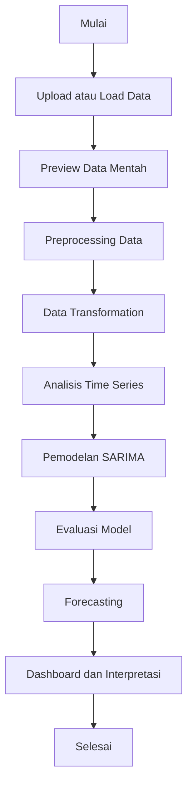
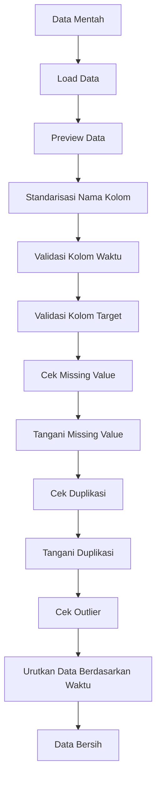
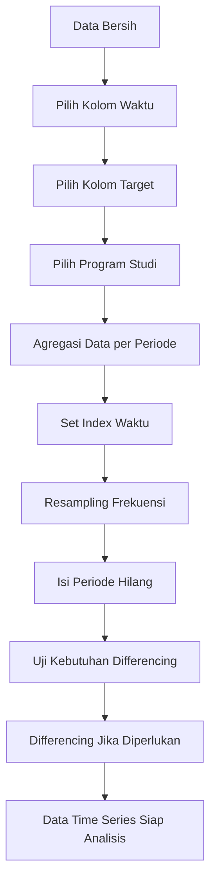
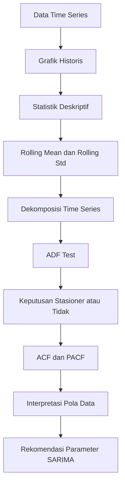

# Penjelasan Lengkap Tahap Preprocessing Data, Data Transformation, dan Analisis Time Series

## Project

**Prediksi Tren Minat Jurusan Mahasiswa Baru Universitas Adzkia Menggunakan Metode SARIMA Berbasis Dashboard Interaktif**

Dokumen ini menjelaskan secara lengkap bagian awal proses pengolahan data sebelum masuk ke pemodelan SARIMA. Fokus utama dokumen ini adalah memperjelas tiga bagian penting dalam dashboard dan skripsi, yaitu:

1. **Preprocessing Data**
2. **Data Transformation**
3. **Analisis Time Series**

Ketiga bagian ini sangat penting karena kualitas model SARIMA sangat bergantung pada kualitas data yang digunakan. Jika data belum bersih, belum berbentuk deret waktu, atau belum dianalisis karakteristiknya, maka hasil prediksi model dapat menjadi kurang valid dan sulit dipertanggungjawabkan secara akademik.

---

# 1. Gambaran Umum Alur Pengolahan Data

Secara umum, data mentah tidak langsung dimasukkan ke model SARIMA. Data harus melewati beberapa tahap terlebih dahulu agar siap digunakan sebagai data deret waktu.

Alur yang disarankan adalah sebagai berikut:

```text
Data Mentah
→ Preprocessing Data
→ Data Transformation
→ Analisis Time Series
→ Pemodelan SARIMA
→ Evaluasi Model
→ Forecasting
→ Dashboard Interpretasi
```

Urutan ini lebih aman dibanding langsung melakukan pemodelan, karena setiap tahap memiliki fungsi yang berbeda.

| Tahap | Fungsi Utama | Hasil Akhir |
|---|---|---|
| Preprocessing Data | Membersihkan dan memvalidasi data | Data bersih |
| Data Transformation | Mengubah data menjadi format time series | Series berdasarkan periode waktu |
| Analisis Time Series | Membaca pola data sebelum model | Informasi tren, musiman, stasioneritas, ACF, PACF |
| Pemodelan SARIMA | Melatih model prediksi | Model SARIMA |
| Evaluasi Model | Mengukur akurasi model | Nilai error dan interpretasi |
| Forecasting | Meramalkan periode mendatang | Tabel dan grafik prediksi |

---

# 2. Diagram Flow Utama

Diagram berikut menggambarkan alur dari data mentah sampai siap masuk ke model SARIMA.



---

# 3. Posisi Tiga Tahap dalam Dashboard

Pada dashboard Streamlit, tiga tahap ini dapat ditempatkan sebagai halaman atau tab terpisah agar lebih mudah dipahami.

Struktur halaman yang disarankan:

```text
Sidebar Dashboard
├── Overview Penelitian
├── Data & Preprocessing
├── Data Transformation
├── Analisis Time Series
├── Pemodelan SARIMA
├── Evaluasi Model
├── Forecasting
└── Kesimpulan
```

Jika dashboard ingin dibuat lebih ringkas, **Preprocessing Data** dan **Data Transformation** dapat digabung dalam satu halaman bernama:

```text
Data Preparation
```

Namun, untuk kebutuhan tugas akhir, lebih baik dipisah agar alurnya terlihat jelas.

---

# 4. Bagian 1 — Preprocessing Data

## 4.1 Pengertian Preprocessing Data

**Preprocessing Data** adalah tahap awal untuk membersihkan, memeriksa, dan memvalidasi data mentah sebelum digunakan dalam analisis dan pemodelan.

Pada penelitian prediksi minat jurusan mahasiswa baru, data yang digunakan biasanya berasal dari file Excel atau CSV yang berisi data pendaftaran mahasiswa. Data tersebut dapat memiliki berbagai masalah, seperti:

- nama kolom tidak konsisten,
- data kosong,
- format tanggal tidak valid,
- jumlah pendaftar tidak terbaca sebagai angka,
- data duplikat,
- periode tidak berurutan,
- nilai ekstrem atau outlier,
- data belum sesuai format time series.

Karena itu, preprocessing diperlukan agar data yang digunakan benar-benar siap untuk dianalisis.

---

## 4.2 Tujuan Preprocessing Data

Tujuan utama preprocessing data adalah memastikan data berada dalam kondisi bersih dan valid.

Secara rinci, preprocessing bertujuan untuk:

1. memastikan data berhasil dibaca oleh sistem,
2. memeriksa struktur dan isi data,
3. memastikan kolom periode/tanggal tersedia,
4. memastikan kolom target berupa data numerik,
5. menangani missing value,
6. menangani data duplikat,
7. mengidentifikasi outlier,
8. mengurutkan data berdasarkan waktu,
9. menghasilkan data bersih yang siap ditransformasikan.

---

## 4.3 Input dan Output Preprocessing Data

| Komponen | Penjelasan |
|---|---|
| Input | Data mentah dari file Excel/CSV |
| Proses | Validasi, pembersihan, pengecekan missing value, duplikasi, outlier |
| Output | Data bersih yang siap masuk ke tahap transformasi |

Contoh input data mentah:

| Tahun | Program Studi | Jumlah Pendaftar |
|---:|---|---:|
| 2021 | Informatika | 55 |
| 2022 | Informatika | 80 |
| 2023 | Informatika | 120 |
| 2024 | Informatika | 160 |
| 2025 | Informatika | 175 |

Contoh output setelah preprocessing:

| tahun | program_studi | jumlah_pendaftar |
|---:|---|---:|
| 2021 | Informatika | 55 |
| 2022 | Informatika | 80 |
| 2023 | Informatika | 120 |
| 2024 | Informatika | 160 |
| 2025 | Informatika | 175 |

Perbedaannya adalah data sudah dirapikan, tipe data divalidasi, dan siap diproses lebih lanjut.

---

# 5. Flow Preprocessing Data



---

# 6. Penjelasan Detail Setiap Tahap Preprocessing Data

## 6.1 Load Data

### Maksudnya

Load data adalah proses membaca file yang digunakan dalam penelitian. File dapat berbentuk:

- `.xlsx`,
- `.xls`,
- `.csv`.

Tahap ini memastikan bahwa file dapat dibaca oleh sistem dan berhasil diubah menjadi dataframe.

### Yang Ditampilkan di Dashboard

- nama file,
- jumlah baris,
- jumlah kolom,
- status berhasil/gagal membaca file.

### Contoh Narasi

> Pada tahap ini, sistem membaca data pendaftaran mahasiswa baru dari file yang diunggah pengguna. Data yang berhasil dimuat kemudian ditampilkan secara ringkas untuk memastikan bahwa file dapat diproses lebih lanjut.

### Contoh Kode

```python
import pandas as pd


def load_data(uploaded_file):
    if uploaded_file.name.endswith(".csv"):
        df = pd.read_csv(uploaded_file)
    elif uploaded_file.name.endswith((".xlsx", ".xls")):
        df = pd.read_excel(uploaded_file)
    else:
        raise ValueError("Format file tidak didukung")

    return df
```

---

## 6.2 Preview Data Mentah

### Maksudnya

Preview data mentah digunakan untuk melihat bentuk awal data sebelum diproses. Bagian ini penting agar peneliti dan pengguna dashboard mengetahui struktur data yang digunakan.

### Yang Ditampilkan

- 5 sampai 10 baris pertama data,
- jumlah baris,
- jumlah kolom,
- nama kolom.

### Contoh Narasi

> Preview data mentah ditampilkan untuk memberikan gambaran awal mengenai struktur data yang digunakan, seperti nama kolom, isi data, dan jumlah baris yang tersedia.

### Contoh Kode

```python
st.subheader("Preview Data Mentah")
st.dataframe(df.head())

st.metric("Jumlah Baris", df.shape[0])
st.metric("Jumlah Kolom", df.shape[1])
```

---

## 6.3 Standarisasi Nama Kolom

### Maksudnya

Nama kolom dari file Excel sering kali tidak konsisten. Misalnya:

```text
Jumlah Pendaftar
jumlah pendaftar
Jumlah_Pendaftar
JUMLAH PENDAFTAR
```

Agar mudah diproses, nama kolom perlu distandarkan menjadi format yang konsisten.

Contoh hasil standarisasi:

```text
jumlah_pendaftar
program_studi
tahun
```

### Contoh Narasi

> Standarisasi nama kolom dilakukan untuk menyamakan format nama kolom sehingga proses pemanggilan data di dalam program menjadi lebih mudah dan mengurangi risiko error akibat perbedaan penulisan.

### Contoh Kode

```python
df.columns = (
    df.columns
    .str.strip()
    .str.lower()
    .str.replace(" ", "_")
)
```

---

## 6.4 Validasi Kolom Waktu

### Maksudnya

Data time series wajib memiliki kolom waktu. Dalam penelitian ini, kolom waktu dapat berupa:

- tahun,
- bulan,
- tanggal daftar,
- periode akademik.

Kolom waktu harus divalidasi agar model dapat membaca urutan data secara benar.

### Contoh Kolom Waktu

| Jenis Data | Contoh Kolom |
|---|---|
| Tahunan | tahun |
| Bulanan | periode |
| Harian | tanggal_daftar |
| Semester | tahun_akademik, semester |

### Contoh Narasi

> Validasi kolom waktu dilakukan untuk memastikan bahwa data memiliki informasi periode yang jelas. Kolom periode diperlukan karena model time series menggunakan urutan waktu sebagai dasar analisis dan peramalan.

### Contoh Kode untuk Data Tahunan

```python
df["tahun"] = pd.to_numeric(df["tahun"], errors="coerce")
```

### Contoh Kode untuk Data Bulanan atau Harian

```python
df["periode"] = pd.to_datetime(df["periode"], errors="coerce")
```

---

## 6.5 Validasi Kolom Target

### Maksudnya

Kolom target adalah kolom angka yang akan diprediksi. Dalam penelitian ini, target dapat berupa:

- jumlah pendaftar,
- jumlah mahasiswa baru,
- jumlah diterima,
- jumlah registrasi ulang.

Kolom target harus berupa numerik agar dapat diproses oleh model SARIMA.

### Contoh Narasi

> Validasi kolom target dilakukan untuk memastikan bahwa data yang akan diprediksi memiliki tipe numerik. Nilai yang tidak dapat dikonversi menjadi angka akan dianggap tidak valid dan perlu ditangani pada tahap pembersihan data.

### Contoh Kode

```python
df["jumlah_pendaftar"] = pd.to_numeric(
    df["jumlah_pendaftar"],
    errors="coerce"
)
```

---

## 6.6 Cek Missing Value

### Maksudnya

Missing value adalah data kosong atau data yang tidak terisi. Missing value perlu diperiksa karena dapat mengganggu proses analisis dan pemodelan.

### Contoh Missing Value

| tahun | program_studi | jumlah_pendaftar |
|---:|---|---:|
| 2021 | Informatika | 55 |
| 2022 | Informatika | 80 |
| 2023 | Informatika |  |
| 2024 | Informatika | 160 |

Pada contoh di atas, jumlah pendaftar tahun 2023 kosong.

### Cara Menangani Missing Value

| Kondisi | Penanganan yang Disarankan |
|---|---|
| Kolom waktu kosong | Baris dihapus |
| Kolom target kosong karena tidak ada pendaftar | Diisi 0 |
| Kolom target kosong karena belum tercatat | Perlu dikonfirmasi atau diberi catatan |
| Missing value sedikit | Bisa dihapus atau diisi sesuai konteks |
| Missing value banyak | Perlu catatan keterbatasan data |

### Contoh Narasi

> Pemeriksaan missing value dilakukan untuk mengetahui apakah terdapat data kosong pada dataset. Data kosong pada kolom waktu tidak dapat digunakan karena tidak memiliki informasi periode, sedangkan data kosong pada kolom target perlu dianalisis terlebih dahulu apakah bernilai nol atau merupakan data yang belum tercatat.

### Contoh Kode

```python
missing_values = df.isnull().sum().reset_index()
missing_values.columns = ["kolom", "jumlah_missing"]
st.dataframe(missing_values)
```

### Contoh Penanganan

```python
# Hapus baris tanpa waktu
df = df.dropna(subset=["tahun"])

# Isi target kosong dengan 0 jika memang berarti tidak ada pendaftar
df["jumlah_pendaftar"] = df["jumlah_pendaftar"].fillna(0)
```

---

## 6.7 Cek Duplikasi Data

### Maksudnya

Duplikasi adalah data yang muncul lebih dari satu kali. Pada data pendaftaran mahasiswa, duplikasi dapat terjadi karena:

- data mahasiswa tercatat dua kali,
- data prodi dan tahun muncul lebih dari satu baris,
- file gabungan antar tahun memiliki data berulang.

### Contoh Duplikasi

| tahun | program_studi | jumlah_pendaftar |
|---:|---|---:|
| 2024 | Informatika | 160 |
| 2024 | Informatika | 160 |

Jika dua baris benar-benar sama, salah satunya dapat dihapus.

Namun jika datanya seperti ini:

| tahun | program_studi | jumlah_pendaftar |
|---:|---|---:|
| 2024 | Informatika | 100 |
| 2024 | Informatika | 60 |

maka tidak langsung dihapus. Data tersebut lebih tepat dijumlahkan menjadi 160.

### Contoh Narasi

> Pemeriksaan duplikasi dilakukan untuk memastikan tidak ada data yang tercatat berulang. Jika duplikasi berupa baris yang sama persis, maka data dapat dihapus. Namun jika terdapat beberapa baris pada periode dan program studi yang sama, data akan diagregasi dengan menjumlahkan nilai target.

### Contoh Kode

```python
duplicate_count = df.duplicated().sum()
st.metric("Jumlah Duplikasi", duplicate_count)

# Hapus duplikasi penuh
df = df.drop_duplicates()
```

### Contoh Agregasi Jika Duplikasi Berdasarkan Tahun dan Prodi

```python
df = df.groupby(["tahun", "program_studi"], as_index=False)["jumlah_pendaftar"].sum()
```

---

## 6.8 Cek Outlier

### Maksudnya

Outlier adalah nilai yang sangat berbeda dari nilai lainnya. Outlier perlu diperiksa karena dapat memengaruhi hasil model.

Contoh:

| tahun | jumlah_pendaftar |
|---:|---:|
| 2021 | 55 |
| 2022 | 60 |
| 2023 | 65 |
| 2024 | 500 |

Nilai 500 terlihat sangat tinggi dibanding tahun sebelumnya. Nilai ini perlu dicek apakah:

- memang terjadi peningkatan nyata,
- ada salah input,
- ada perubahan kebijakan penerimaan,
- ada penggabungan data dari beberapa prodi.

### Catatan Penting

Outlier tidak boleh langsung dihapus. Dalam konteks pendaftaran mahasiswa, lonjakan jumlah pendaftar bisa jadi merupakan fakta penting, misalnya karena:

- promosi besar-besaran,
- perubahan status kampus,
- pembukaan prodi baru,
- perubahan strategi PMB,
- meningkatnya minat masyarakat.

### Contoh Narasi

> Identifikasi outlier dilakukan untuk menemukan nilai yang berbeda jauh dari pola umum data. Outlier tidak langsung dihapus karena pada data pendaftaran mahasiswa, nilai ekstrem dapat mencerminkan kejadian nyata yang penting untuk dianalisis.

### Contoh Kode IQR

```python
q1 = df["jumlah_pendaftar"].quantile(0.25)
q3 = df["jumlah_pendaftar"].quantile(0.75)
iqr = q3 - q1

lower_bound = q1 - 1.5 * iqr
upper_bound = q3 + 1.5 * iqr

outlier_df = df[
    (df["jumlah_pendaftar"] < lower_bound) |
    (df["jumlah_pendaftar"] > upper_bound)
]

st.dataframe(outlier_df)
```

---

## 6.9 Mengurutkan Data Berdasarkan Waktu

### Maksudnya

Data time series harus disusun berdasarkan urutan waktu dari periode paling lama ke periode terbaru.

Contoh yang salah:

| tahun | jumlah_pendaftar |
|---:|---:|
| 2024 | 160 |
| 2021 | 55 |
| 2023 | 120 |
| 2022 | 80 |

Contoh yang benar:

| tahun | jumlah_pendaftar |
|---:|---:|
| 2021 | 55 |
| 2022 | 80 |
| 2023 | 120 |
| 2024 | 160 |

### Contoh Narasi

> Pengurutan data berdasarkan waktu dilakukan agar urutan observasi sesuai dengan karakteristik data time series. Hal ini penting karena model peramalan bergantung pada hubungan antarperiode secara berurutan.

### Contoh Kode

```python
df = df.sort_values("tahun")
```

Atau untuk data tanggal:

```python
df = df.sort_values("periode")
```

---

# 7. Output Preprocessing Data

Output dari tahap preprocessing adalah data bersih.

Dashboard sebaiknya menampilkan ringkasan seperti berikut:

| Komponen | Nilai |
|---|---:|
| Jumlah data awal | ... |
| Jumlah data setelah cleaning | ... |
| Jumlah missing value | ... |
| Jumlah duplikasi | ... |
| Jumlah outlier terdeteksi | ... |
| Status validasi kolom waktu | Valid / Tidak valid |
| Status validasi kolom target | Valid / Tidak valid |

Contoh narasi output:

> Setelah proses preprocessing dilakukan, data telah memiliki kolom waktu yang valid, kolom target numerik, tidak terdapat missing value pada kolom utama, serta data telah diurutkan berdasarkan periode. Data hasil preprocessing selanjutnya digunakan pada tahap transformasi data.

---

# 8. Bagian 2 — Data Transformation

## 8.1 Pengertian Data Transformation

**Data Transformation** adalah tahap mengubah data bersih menjadi format deret waktu yang sesuai untuk analisis time series dan model SARIMA.

Tahap ini berbeda dari preprocessing. Preprocessing berfokus pada pembersihan data, sedangkan transformation berfokus pada pembentukan data agar sesuai struktur waktu.

Dengan kata lain:

```text
Preprocessing = membersihkan data
Transformation = membentuk data menjadi time series
```

---

## 8.2 Tujuan Data Transformation

Tujuan data transformation adalah:

1. mengubah data mentah menjadi data agregat per periode,
2. memilih program studi yang akan dianalisis,
3. membentuk indeks waktu,
4. melakukan resampling sesuai frekuensi data,
5. mengisi periode yang hilang,
6. melakukan differencing jika data belum stasioner,
7. menghasilkan data time series yang siap dianalisis.

---

## 8.3 Input dan Output Data Transformation

| Komponen | Penjelasan |
|---|---|
| Input | Data bersih hasil preprocessing |
| Proses | Agregasi, filter prodi, set index waktu, resampling, differencing |
| Output | Data time series siap analisis |

Contoh input:

| tahun | program_studi | jumlah_pendaftar |
|---:|---|---:|
| 2021 | Informatika | 55 |
| 2022 | Informatika | 80 |
| 2023 | Informatika | 120 |

Contoh output:

```text
2021    55
2022    80
2023    120
2024    160
2025    175
```

---

# 9. Flow Data Transformation



---

# 10. Penjelasan Detail Setiap Tahap Data Transformation

## 10.1 Agregasi Data per Periode

### Maksudnya

Agregasi adalah proses mengelompokkan data berdasarkan periode tertentu, lalu menghitung jumlah target.

Jika data mentah masih berupa daftar mahasiswa satu per satu, maka perlu dihitung jumlah pendaftar per periode.

Contoh data mentah:

| tanggal_daftar | nama | program_studi |
|---|---|---|
| 2024-01-01 | A | Informatika |
| 2024-01-02 | B | Informatika |
| 2024-01-03 | C | PGSD |

Setelah agregasi bulanan:

| periode | program_studi | jumlah_pendaftar |
|---|---|---:|
| 2024-01 | Informatika | 2 |
| 2024-01 | PGSD | 1 |

### Contoh Narasi

> Agregasi data dilakukan untuk mengubah data pendaftaran individu menjadi jumlah pendaftar per periode. Tahap ini diperlukan agar data dapat digunakan sebagai data deret waktu.

### Contoh Kode Agregasi Bulanan

```python
df["periode"] = pd.to_datetime(df["tanggal_daftar"], errors="coerce")
df["periode"] = df["periode"].dt.to_period("M").dt.to_timestamp()

ts_df = (
    df.groupby(["periode", "program_studi"])
    .size()
    .reset_index(name="jumlah_pendaftar")
)
```

### Contoh Kode Agregasi Tahunan

```python
ts_df = (
    df.groupby(["tahun", "program_studi"], as_index=False)["jumlah_pendaftar"]
    .sum()
)
```

---

## 10.2 Filter Program Studi

### Maksudnya

Karena penelitian membahas tren minat jurusan, pengguna dashboard perlu memilih program studi yang ingin dianalisis.

Contoh pilihan:

- Informatika,
- PGSD,
- Pendidikan Bahasa Indonesia,
- Pendidikan Matematika,
- dan lainnya.

### Contoh Narasi

> Filter program studi digunakan agar analisis dapat difokuskan pada jurusan tertentu. Dengan fitur ini, pengguna dapat melihat tren dan hasil prediksi untuk masing-masing program studi secara terpisah.

### Contoh Kode

```python
selected_prodi = st.selectbox(
    "Pilih Program Studi",
    ts_df["program_studi"].unique()
)

prodi_df = ts_df[ts_df["program_studi"] == selected_prodi]
```

---

## 10.3 Set Index Waktu

### Maksudnya

Dalam time series, kolom waktu harus menjadi index agar data dapat dibaca sebagai urutan waktu.

### Contoh Narasi

> Setelah data difilter berdasarkan program studi, kolom periode dijadikan sebagai index waktu. Hal ini bertujuan agar data dapat diproses sebagai data deret waktu oleh library analisis time series.

### Contoh Kode untuk Data Bulanan

```python
series = prodi_df.set_index("periode")["jumlah_pendaftar"]
series = series.sort_index()
```

### Contoh Kode untuk Data Tahunan

```python
series = prodi_df.set_index("tahun")["jumlah_pendaftar"]
series = series.sort_index()
```

---

## 10.4 Resampling Frekuensi

### Maksudnya

Resampling adalah proses menyamakan frekuensi data. Misalnya:

- data harian menjadi bulanan,
- data bulanan menjadi tahunan,
- data transaksi menjadi jumlah per bulan.

Untuk SARIMA, frekuensi data harus jelas.

| Jenis Data | Frekuensi | Contoh Seasonal Period |
|---|---|---:|
| Bulanan | MS | 12 |
| Mingguan | W | 52 |
| Harian | D | 7 atau 365 |
| Tahunan | YS | Tidak ideal untuk SARIMA musiman jika data sedikit |

### Contoh Narasi

> Resampling dilakukan untuk menyusun data berdasarkan frekuensi waktu tertentu. Pada penelitian ini, data dapat disusun secara tahunan atau bulanan sesuai ketersediaan data. Frekuensi data yang jelas diperlukan agar model SARIMA dapat menentukan pola musiman secara tepat.

### Contoh Kode Bulanan

```python
series = series.resample("MS").sum()
```

### Contoh Kode Tahunan

```python
series = series.resample("YS").sum()
```

---

## 10.5 Mengisi Periode yang Hilang

### Maksudnya

Kadang data tidak lengkap pada semua periode.

Contoh:

| tahun | jumlah_pendaftar |
|---:|---:|
| 2021 | 55 |
| 2022 | 80 |
| 2024 | 160 |
| 2025 | 175 |

Tahun 2023 hilang. Jika tidak ditangani, model dapat membaca data secara tidak konsisten.

### Contoh Narasi

> Pengisian periode yang hilang dilakukan untuk memastikan data memiliki interval waktu yang konsisten. Apabila terdapat periode tanpa data, sistem akan menyesuaikan nilai berdasarkan konteks data, misalnya mengisi dengan nol jika tidak ada pendaftar atau menggunakan interpolasi jika data dianggap hilang karena pencatatan.

### Contoh Kode

```python
series = series.asfreq("MS")
series = series.fillna(0)
```

Untuk data tahunan:

```python
full_years = range(series.index.min(), series.index.max() + 1)
series = series.reindex(full_years).fillna(0)
```

---

## 10.6 Differencing

### Maksudnya

Differencing adalah proses menghitung selisih antara nilai saat ini dengan nilai sebelumnya. Tujuannya adalah membuat data lebih stasioner.

Contoh:

| tahun | jumlah_pendaftar | differencing |
|---:|---:|---:|
| 2021 | 55 | - |
| 2022 | 80 | 25 |
| 2023 | 120 | 40 |
| 2024 | 160 | 40 |

Rumus sederhana:

```text
Differencing = Nilai periode sekarang - Nilai periode sebelumnya
```

### Jenis Differencing

| Jenis | Fungsi |
|---|---|
| Non-seasonal differencing | Menghilangkan tren umum |
| Seasonal differencing | Menghilangkan pola musiman berulang |

### Contoh Kode Non-seasonal Differencing

```python
series_diff = series.diff().dropna()
```

### Contoh Kode Seasonal Differencing Bulanan

```python
series_seasonal_diff = series.diff(12).dropna()
```

### Catatan Khusus Data Tahunan 2021–2025

Jika data hanya tahunan dari 2021 sampai 2025, jumlah observasi hanya 5. Pada kondisi ini, differencing tetap dapat dilakukan secara teknis, tetapi hasilnya sangat terbatas.

Contoh:

| tahun | jumlah_pendaftar | differencing |
|---:|---:|---:|
| 2021 | 371 | - |
| 2022 | 587 | 216 |
| 2023 | 714 | 127 |
| 2024 | 1125 | 411 |
| 2025 | 1148 | 23 |

Setelah differencing, jumlah data tinggal 4. Ini sangat sedikit untuk SARIMA. Karena itu, dashboard perlu memberikan peringatan.

Contoh peringatan:

> Jumlah data masih terbatas untuk analisis SARIMA musiman. Hasil differencing dan pemodelan perlu diinterpretasikan sebagai analisis awal, bukan sebagai hasil prediksi yang sangat kuat.

---

# 11. Output Data Transformation

Output dari data transformation adalah data time series yang siap dianalisis.

Contoh output:

| periode | jumlah_pendaftar |
|---|---:|
| 2021 | 55 |
| 2022 | 80 |
| 2023 | 120 |
| 2024 | 160 |
| 2025 | 175 |

Dashboard dapat menampilkan ringkasan seperti berikut:

| Tahap | Jumlah Data | Keterangan |
|---|---:|---|
| Data hasil preprocessing | 500 | Data sudah bersih |
| Setelah agregasi | 60 | Data menjadi periode bulanan |
| Setelah filter prodi | 60 | Data untuk satu prodi |
| Setelah differencing | 59 | Data siap diuji stasioneritas |

Contoh narasi output:

> Data hasil transformasi telah disusun menjadi deret waktu berdasarkan periode dan program studi yang dipilih. Data ini kemudian digunakan pada tahap analisis time series untuk mengidentifikasi tren, pola musiman, dan kestasioneran data.

---

# 12. Bagian 3 — Analisis Time Series

## 12.1 Pengertian Analisis Time Series

**Analisis Time Series** adalah tahap untuk memahami karakteristik data yang berubah berdasarkan waktu.

Pada penelitian ini, analisis time series digunakan untuk melihat pola jumlah pendaftar mahasiswa baru dari periode ke periode.

Analisis ini dilakukan sebelum model SARIMA dibuat, karena model harus disesuaikan dengan karakteristik data.

---

## 12.2 Tujuan Analisis Time Series

Analisis time series bertujuan untuk:

1. melihat pola historis jumlah pendaftar,
2. mengetahui apakah data memiliki tren naik atau turun,
3. mengetahui apakah terdapat pola musiman,
4. mengecek kestabilan data,
5. menguji stasioneritas data,
6. membantu menentukan parameter SARIMA,
7. memberikan dasar interpretasi sebelum forecasting.

---

## 12.3 Input dan Output Analisis Time Series

| Komponen | Penjelasan |
|---|---|
| Input | Data time series hasil transformation |
| Proses | Grafik historis, statistik deskriptif, rolling mean, decomposition, ADF, ACF, PACF |
| Output | Informasi pola data dan kesiapan model |

---

# 13. Flow Analisis Time Series



---

# 14. Penjelasan Detail Setiap Tahap Analisis Time Series

## 14.1 Grafik Historis

### Maksudnya

Grafik historis adalah grafik garis yang menampilkan jumlah pendaftar dari waktu ke waktu.

Grafik ini membantu melihat apakah data:

- meningkat,
- menurun,
- stabil,
- fluktuatif,
- memiliki pola berulang.

### Contoh Narasi

> Grafik historis digunakan untuk melihat perkembangan jumlah pendaftar mahasiswa baru dari periode ke periode. Melalui grafik ini, dapat diketahui apakah suatu program studi mengalami peningkatan minat, penurunan minat, atau fluktuasi pada periode tertentu.

### Contoh Kode

```python
import plotly.express as px

fig = px.line(
    x=series.index,
    y=series.values,
    markers=True,
    title="Grafik Historis Jumlah Pendaftar"
)

fig.update_layout(
    xaxis_title="Periode",
    yaxis_title="Jumlah Pendaftar"
)

st.plotly_chart(fig, use_container_width=True)
```

---

## 14.2 Statistik Deskriptif

### Maksudnya

Statistik deskriptif digunakan untuk melihat karakteristik umum data.

Yang biasa dihitung:

- jumlah observasi,
- rata-rata,
- median,
- nilai minimum,
- nilai maksimum,
- standar deviasi.

### Contoh Narasi

> Statistik deskriptif digunakan untuk mengetahui gambaran umum data, seperti rata-rata jumlah pendaftar, nilai tertinggi, nilai terendah, serta variasi jumlah pendaftar pada program studi yang dianalisis.

### Contoh Kode

```python
desc = series.describe()
st.dataframe(desc)
```

---

## 14.3 Rolling Mean dan Rolling Standard Deviation

### Maksudnya

Rolling mean adalah rata-rata bergerak. Rolling standard deviation adalah standar deviasi bergerak.

Keduanya digunakan untuk melihat apakah rata-rata dan variasi data berubah dari waktu ke waktu.

Jika rolling mean terus naik, berarti data memiliki tren naik. Jika rolling standard deviation berubah besar, berarti variasi data tidak stabil.

### Contoh Narasi

> Rolling mean digunakan untuk melihat kecenderungan rata-rata data dalam beberapa periode terakhir, sedangkan rolling standard deviation digunakan untuk melihat perubahan tingkat variasi data dari waktu ke waktu. Kedua komponen ini membantu mengevaluasi kestabilan data sebelum dilakukan pemodelan SARIMA.

### Contoh Kode Data Bulanan

```python
rolling_mean = series.rolling(window=12).mean()
rolling_std = series.rolling(window=12).std()
```

### Contoh Kode Data Tahunan

```python
rolling_mean = series.rolling(window=2).mean()
rolling_std = series.rolling(window=2).std()
```

---

## 14.4 Dekomposisi Time Series

### Maksudnya

Dekomposisi time series adalah proses memecah data menjadi beberapa komponen:

1. **Trend**: arah pergerakan jangka panjang,
2. **Seasonal**: pola musiman yang berulang,
3. **Residual**: sisa variasi yang tidak dijelaskan oleh trend dan seasonal.

### Contoh Narasi

> Dekomposisi time series dilakukan untuk memisahkan data menjadi komponen trend, seasonal, dan residual. Komponen trend menunjukkan arah pergerakan data secara umum, komponen seasonal menunjukkan pola berulang pada periode tertentu, sedangkan residual menunjukkan variasi acak yang tersisa.

### Contoh Kode Data Bulanan

```python
from statsmodels.tsa.seasonal import seasonal_decompose

result = seasonal_decompose(
    series,
    model="additive",
    period=12
)

fig = result.plot()
st.pyplot(fig)
```

### Catatan untuk Data Tahunan

Jika data hanya terdiri dari 5 tahun, dekomposisi musiman tidak disarankan sebagai dasar utama karena jumlah observasi terlalu sedikit.

Narasi aman:

> Karena jumlah data tahunan masih terbatas, dekomposisi time series digunakan hanya sebagai analisis pendukung. Untuk mengidentifikasi pola musiman secara lebih kuat, diperlukan data dengan frekuensi bulanan atau mingguan.

---

## 14.5 Uji Stasioneritas ADF

### Maksudnya

ADF Test atau Augmented Dickey-Fuller Test digunakan untuk mengetahui apakah data sudah stasioner.

Data dikatakan stasioner apabila karakteristik statistiknya relatif stabil sepanjang waktu.

### Kenapa Stasioneritas Penting?

Model ARIMA dan SARIMA lebih baik digunakan pada data yang stasioner. Jika data belum stasioner, maka perlu dilakukan differencing.

### Aturan Keputusan

| p-value | Keputusan |
|---:|---|
| < 0.05 | Data stasioner |
| >= 0.05 | Data belum stasioner |

### Contoh Narasi Jika Data Stasioner

> Berdasarkan hasil ADF Test, nilai p-value lebih kecil dari 0,05 sehingga data dapat dianggap stasioner. Dengan demikian, data dapat dilanjutkan ke tahap pemodelan tanpa perlu differencing tambahan.

### Contoh Narasi Jika Data Belum Stasioner

> Berdasarkan hasil ADF Test, nilai p-value lebih besar dari 0,05 sehingga data belum stasioner. Oleh karena itu, perlu dilakukan proses differencing agar data lebih stabil sebelum digunakan dalam model SARIMA.

### Contoh Kode

```python
from statsmodels.tsa.stattools import adfuller

adf_result = adfuller(series.dropna())

adf_table = pd.DataFrame({
    "Komponen": [
        "ADF Statistic",
        "p-value",
        "Jumlah Lag",
        "Jumlah Observasi"
    ],
    "Nilai": [
        adf_result[0],
        adf_result[1],
        adf_result[2],
        adf_result[3]
    ]
})

st.dataframe(adf_table)
```

---

## 14.6 ACF dan PACF

### Maksudnya

ACF dan PACF digunakan untuk melihat hubungan data dengan nilai sebelumnya pada berbagai lag.

- **ACF** membantu membaca hubungan nilai saat ini dengan nilai masa lalu secara keseluruhan.
- **PACF** membantu membaca hubungan langsung nilai saat ini dengan nilai masa lalu pada lag tertentu.

### Fungsi dalam SARIMA

| Grafik | Membantu Menentukan |
|---|---|
| ACF | Parameter q dan Q |
| PACF | Parameter p dan P |

### Contoh Narasi

> Grafik ACF dan PACF digunakan untuk membantu mengidentifikasi parameter awal model SARIMA. ACF dapat memberikan indikasi nilai moving average, sedangkan PACF dapat memberikan indikasi nilai autoregressive.

### Contoh Kode

```python
from statsmodels.graphics.tsaplots import plot_acf, plot_pacf
import matplotlib.pyplot as plt

fig_acf, ax_acf = plt.subplots()
plot_acf(series.dropna(), ax=ax_acf)
st.pyplot(fig_acf)

fig_pacf, ax_pacf = plt.subplots()
plot_pacf(series.dropna(), ax=ax_pacf)
st.pyplot(fig_pacf)
```

---

# 15. Catatan Khusus untuk Data Tahunan 2021–2025

Jika data yang digunakan hanya berupa data tahunan periode 2021 sampai 2025, maka jumlah data hanya 5 observasi.

Contoh:

| Tahun | Jumlah Pendaftar |
|---:|---:|
| 2021 | 371 |
| 2022 | 587 |
| 2023 | 714 |
| 2024 | 1125 |
| 2025 | 1148 |

Data seperti ini masih dapat dianalisis sebagai data time series tahunan, tetapi memiliki keterbatasan untuk SARIMA musiman.

## 15.1 Kelemahan Data Tahunan yang Terlalu Sedikit

| Masalah | Dampak |
|---|---|
| Observasi hanya 5 | Model sulit belajar pola |
| Pola musiman sulit dibuktikan | SARIMA musiman menjadi lemah |
| ACF/PACF kurang stabil | Parameter sulit ditentukan |
| ADF Test kurang kuat | Keputusan stasioneritas tidak kokoh |
| Evaluasi model terbatas | Nilai MAPE/MSE kurang representatif |

## 15.2 Narasi Aman untuk Dashboard

> Data yang digunakan merupakan data tahunan jumlah pendaftar mahasiswa baru. Karena jumlah observasi masih terbatas, hasil analisis time series dan pemodelan SARIMA perlu diinterpretasikan secara hati-hati. Untuk meningkatkan validitas model SARIMA, diperlukan data dengan frekuensi yang lebih detail, misalnya data bulanan atau mingguan.

## 15.3 Rekomendasi Data yang Lebih Baik

Agar SARIMA lebih kuat, data sebaiknya berbentuk bulanan.

Contoh:

| periode | program_studi | jumlah_pendaftar |
|---|---|---:|
| 2021-01 | Informatika | 5 |
| 2021-02 | Informatika | 8 |
| 2021-03 | Informatika | 12 |
| 2021-04 | Informatika | 10 |

Dengan data bulanan 2021–2025, jumlah data menjadi sekitar 60 observasi. Ini jauh lebih baik untuk SARIMA.

---

# 16. Struktur Implementasi dalam Dashboard Streamlit

## 16.1 Halaman Data & Preprocessing

Isi halaman:

1. upload data,
2. preview data mentah,
3. informasi jumlah baris dan kolom,
4. informasi tipe data,
5. missing value,
6. duplikasi,
7. outlier,
8. data hasil cleaning,
9. narasi interpretasi preprocessing.

Contoh layout:

```text
Judul: Data & Preprocessing

[Upload File]

[Preview Data Mentah]

[Jumlah Baris] [Jumlah Kolom] [Missing Value] [Duplikasi]

[Tabel Tipe Data]
[Tabel Missing Value]
[Tabel Outlier]

[Data Setelah Preprocessing]

[Interpretasi]
```

---

## 16.2 Halaman Data Transformation

Isi halaman:

1. pilihan program studi,
2. pilihan frekuensi data,
3. agregasi data,
4. set index waktu,
5. resampling,
6. differencing,
7. tabel hasil transformasi,
8. grafik data setelah transformasi.

Contoh layout:

```text
Judul: Data Transformation

[Pilih Program Studi]
[Pilih Frekuensi Data]

[Tabel Hasil Agregasi]
[Tabel Time Series]
[Grafik Setelah Transformasi]

[Data Differencing Jika Diperlukan]

[Interpretasi]
```

---

## 16.3 Halaman Analisis Time Series

Isi halaman:

1. grafik historis,
2. statistik deskriptif,
3. rolling mean dan rolling standard deviation,
4. dekomposisi,
5. ADF Test,
6. ACF dan PACF,
7. interpretasi hasil analisis.

Contoh layout:

```text
Judul: Analisis Time Series

[Grafik Historis]

[Statistik Deskriptif]

[Rolling Mean dan Rolling Std]

[Dekomposisi Time Series]

[ADF Test]

[ACF dan PACF]

[Interpretasi Pola Data]
```

---

# 17. Contoh Kode Fungsi Lengkap

## 17.1 Fungsi Preprocessing

```python
import pandas as pd


def preprocess_data(df, date_col, target_col, category_col=None):
    """
    Fungsi untuk membersihkan dan memvalidasi data sebelum digunakan
    dalam analisis time series.
    """

    df = df.copy()

    # Standarisasi nama kolom
    df.columns = (
        df.columns
        .str.strip()
        .str.lower()
        .str.replace(" ", "_")
    )

    # Validasi kolom tersedia
    required_cols = [date_col, target_col]
    if category_col:
        required_cols.append(category_col)

    for col in required_cols:
        if col not in df.columns:
            raise ValueError(f"Kolom {col} tidak ditemukan dalam dataset")

    # Konversi kolom waktu
    if date_col == "tahun":
        df[date_col] = pd.to_numeric(df[date_col], errors="coerce")
    else:
        df[date_col] = pd.to_datetime(df[date_col], errors="coerce")

    # Konversi kolom target
    df[target_col] = pd.to_numeric(df[target_col], errors="coerce")

    # Hapus baris tanpa periode
    df = df.dropna(subset=[date_col])

    # Isi target kosong dengan 0
    df[target_col] = df[target_col].fillna(0)

    # Hapus duplikasi penuh
    df = df.drop_duplicates()

    # Urutkan data
    df = df.sort_values(date_col)

    return df
```

---

## 17.2 Fungsi Deteksi Outlier

```python
def detect_outliers_iqr(df, target_col):
    """
    Fungsi untuk mendeteksi outlier menggunakan metode IQR.
    Outlier tidak langsung dihapus, hanya ditampilkan untuk dianalisis.
    """

    q1 = df[target_col].quantile(0.25)
    q3 = df[target_col].quantile(0.75)
    iqr = q3 - q1

    lower_bound = q1 - 1.5 * iqr
    upper_bound = q3 + 1.5 * iqr

    outlier_df = df[
        (df[target_col] < lower_bound) |
        (df[target_col] > upper_bound)
    ]

    return outlier_df, lower_bound, upper_bound
```

---

## 17.3 Fungsi Data Transformation

```python
def transform_to_timeseries(
    df,
    date_col,
    target_col,
    freq="Y",
    category_col=None,
    selected_category=None
):
    """
    Fungsi untuk mengubah data bersih menjadi format time series.
    """

    data = df.copy()

    # Filter kategori/prodi jika ada
    if category_col and selected_category:
        data = data[data[category_col] == selected_category]

    # Jika data tahunan
    if date_col == "tahun":
        data = data.groupby(date_col, as_index=False)[target_col].sum()
        series = data.set_index(date_col)[target_col]
        series = series.sort_index()
        return series

    # Jika data tanggal/bulanan
    data = data.set_index(date_col)

    if freq == "M":
        series = data[target_col].resample("MS").sum()
    elif freq == "Y":
        series = data[target_col].resample("YS").sum()
    else:
        series = data[target_col].resample(freq).sum()

    series = series.fillna(0)

    return series
```

---

## 17.4 Fungsi Analisis Time Series

```python
from statsmodels.tsa.stattools import adfuller


def analyze_timeseries(series):
    """
    Fungsi untuk menghasilkan ringkasan analisis time series.
    """

    result = {}

    result["jumlah_observasi"] = len(series.dropna())
    result["rata_rata"] = series.mean()
    result["median"] = series.median()
    result["minimum"] = series.min()
    result["maksimum"] = series.max()
    result["standar_deviasi"] = series.std()

    # ADF Test hanya dilakukan jika data cukup
    if len(series.dropna()) >= 8:
        adf_result = adfuller(series.dropna())
        result["adf_statistic"] = adf_result[0]
        result["p_value"] = adf_result[1]
        result["stasioner"] = adf_result[1] < 0.05
    else:
        result["adf_statistic"] = None
        result["p_value"] = None
        result["stasioner"] = "Data terlalu sedikit untuk ADF Test yang kuat"

    return result
```

---

# 18. Contoh Narasi Siap Pakai untuk Skripsi

## 18.1 Narasi Preprocessing Data

> Pada tahap preprocessing data, dilakukan proses pembersihan dan validasi data historis pendaftaran mahasiswa baru. Proses ini meliputi pemeriksaan struktur data, standarisasi nama kolom, validasi kolom periode, validasi kolom jumlah pendaftar, pemeriksaan nilai kosong, penghapusan data duplikat, identifikasi outlier, serta pengurutan data berdasarkan waktu. Tahapan ini bertujuan untuk memastikan bahwa data berada dalam kondisi bersih, konsisten, dan siap digunakan dalam proses transformasi data deret waktu.

## 18.2 Narasi Data Transformation

> Setelah data melewati proses preprocessing, dilakukan tahap transformasi data untuk mengubah data bersih menjadi format deret waktu. Transformasi dilakukan dengan mengelompokkan data berdasarkan periode dan program studi, kemudian menghitung jumlah pendaftar pada setiap periode. Data hasil agregasi selanjutnya disusun berdasarkan urutan waktu, dilakukan resampling sesuai frekuensi data, dan dilakukan differencing apabila data belum stasioner. Hasil dari tahap ini adalah data time series yang siap digunakan untuk analisis dan pemodelan SARIMA.

## 18.3 Narasi Analisis Time Series

> Tahap analisis time series dilakukan untuk memahami karakteristik data jumlah pendaftar mahasiswa baru pada setiap program studi. Analisis ini meliputi visualisasi data historis, statistik deskriptif, rolling mean, rolling standard deviation, dekomposisi time series, uji stasioneritas menggunakan ADF Test, serta analisis ACF dan PACF. Hasil analisis ini digunakan sebagai dasar dalam menentukan parameter model SARIMA serta menilai apakah data memiliki pola tren dan pola musiman yang dapat dimodelkan.

---

# 19. Contoh Narasi Siap Pakai untuk Dashboard

## 19.1 Narasi Dashboard Preprocessing

> Data yang ditampilkan pada halaman ini merupakan data mentah yang telah diunggah ke sistem. Sistem melakukan proses validasi terhadap kolom waktu dan kolom target, memeriksa nilai kosong, mengecek duplikasi, serta mengidentifikasi outlier. Setelah proses pembersihan selesai, data disusun kembali agar siap digunakan pada tahap transformasi time series.

## 19.2 Narasi Dashboard Transformation

> Data hasil preprocessing kemudian diubah menjadi format deret waktu. Pada tahap ini, pengguna dapat memilih program studi yang ingin dianalisis. Sistem akan mengelompokkan data berdasarkan periode, menghitung jumlah pendaftar, menyusun data berdasarkan urutan waktu, serta melakukan differencing apabila diperlukan.

## 19.3 Narasi Dashboard Analisis Time Series

> Halaman ini menampilkan analisis pola data jumlah pendaftar mahasiswa baru. Grafik historis digunakan untuk melihat tren data, statistik deskriptif digunakan untuk memahami karakteristik umum data, sedangkan ADF Test, ACF, dan PACF digunakan sebagai dasar dalam menentukan kesiapan data untuk model SARIMA.

---

# 20. Checklist untuk Dashboard

## 20.1 Checklist Preprocessing Data

- [ ] Data berhasil diunggah.
- [ ] Preview data mentah ditampilkan.
- [ ] Nama kolom distandarkan.
- [ ] Kolom waktu tervalidasi.
- [ ] Kolom target tervalidasi.
- [ ] Missing value dihitung.
- [ ] Missing value ditangani.
- [ ] Duplikasi dihitung.
- [ ] Duplikasi ditangani.
- [ ] Outlier dideteksi.
- [ ] Data diurutkan berdasarkan waktu.
- [ ] Data bersih ditampilkan.

## 20.2 Checklist Data Transformation

- [ ] Data diagregasi berdasarkan periode.
- [ ] Program studi dapat dipilih.
- [ ] Data difilter berdasarkan program studi.
- [ ] Index waktu dibentuk.
- [ ] Frekuensi data ditentukan.
- [ ] Periode hilang ditangani.
- [ ] Differencing tersedia jika diperlukan.
- [ ] Data time series ditampilkan.

## 20.3 Checklist Analisis Time Series

- [ ] Grafik historis tersedia.
- [ ] Statistik deskriptif tersedia.
- [ ] Rolling mean tersedia.
- [ ] Rolling standard deviation tersedia.
- [ ] Dekomposisi tersedia jika data cukup.
- [ ] ADF Test tersedia jika data cukup.
- [ ] ACF tersedia.
- [ ] PACF tersedia.
- [ ] Interpretasi hasil analisis tersedia.

---

# 21. Kesimpulan

Bagian **Preprocessing Data**, **Data Transformation**, dan **Analisis Time Series** sebaiknya tidak dibiarkan kosong karena ketiga bagian tersebut merupakan dasar utama sebelum masuk ke pemodelan SARIMA.

Urutan yang paling disarankan adalah:

```text
Preprocessing Data
→ Data Transformation
→ Analisis Time Series
```

Dengan urutan tersebut, alur penelitian menjadi lebih jelas:

1. data dibersihkan terlebih dahulu,
2. data dibentuk menjadi deret waktu,
3. data dianalisis karakteristiknya,
4. baru kemudian data digunakan untuk model SARIMA.

Jika data hanya tahunan 2021–2025, dashboard tetap dapat dibuat, tetapi harus diberi catatan keterbatasan. Untuk penerapan SARIMA yang lebih kuat, data bulanan atau mingguan jauh lebih disarankan karena memiliki jumlah observasi yang lebih banyak dan pola musiman yang lebih mudah dibuktikan.
