# Perancangan dan Flow Lengkap Dashboard Forecasting Tren Minat Jurusan Mahasiswa Baru Menggunakan Streamlit dan SARIMA

## 0. Identitas Dokumen

| Item | Keterangan |
|---|---|
| Nama project | Dashboard Forecasting Tren Minat Jurusan Mahasiswa Baru |
| Objek penelitian | Data pendaftaran / penerimaan mahasiswa baru Universitas Adzkia |
| Metode utama | SARIMA atau Seasonal Autoregressive Integrated Moving Average |
| Framework dashboard | Streamlit |
| Bahasa pemrograman | Python |
| Tujuan utama | Menampilkan analisis historis, proses pemodelan, evaluasi, dan hasil prediksi tren minat jurusan mahasiswa baru |
| Bentuk dokumen | Perancangan sistem, flow aplikasi, flow penelitian, flow data, dan flow pemodelan |
| Catatan penting | Jika data hanya tahunan 2021–2025, penggunaan SARIMA musiman perlu diberi catatan keterbatasan. Data bulanan atau mingguan lebih disarankan agar SARIMA lebih kuat secara metodologi. |

---

## 1. Ringkasan Utama Perancangan

Project ini dirancang sebagai **dashboard penelitian forecasting**, bukan dashboard bisnis biasa. Artinya, dashboard tidak hanya menampilkan hasil prediksi, tetapi juga menampilkan proses ilmiah yang mendukung hasil prediksi tersebut.

Dashboard harus mampu menjawab pertanyaan berikut:

1. Data apa yang digunakan?
2. Bagaimana data dibersihkan dan dipersiapkan?
3. Apakah data memiliki tren?
4. Apakah data memiliki pola musiman?
5. Apakah data cukup layak untuk metode SARIMA?
6. Bagaimana parameter SARIMA dipilih?
7. Bagaimana hasil evaluasi model?
8. Bagaimana hasil prediksi periode berikutnya?
9. Bagaimana interpretasi hasil prediksi tersebut?
10. Apa keterbatasan penelitian dan dashboard?

Flow final dashboard yang disarankan:

```text
Overview Penelitian
→ Data & Preprocessing
→ Analisis Time Series
→ Pemodelan SARIMA
→ Evaluasi & Diagnostik Model
→ Forecasting & Interpretasi
→ Kesimpulan / Rekomendasi
```

Alur ini dipilih karena sesuai dengan kebutuhan tugas akhir. Dosen pembimbing dan penguji biasanya tidak hanya ingin melihat grafik prediksi, tetapi juga ingin melihat alasan kenapa data diproses seperti itu, kenapa SARIMA digunakan, bagaimana model dievaluasi, dan apakah hasilnya dapat dipertanggungjawabkan.

---

## 2. Catatan Metodologi Paling Penting

### 2.1 Masalah Data Tahunan 2021–2025

Jika data yang digunakan hanya berupa data tahunan seperti:

| Tahun | Jumlah Pendaftar |
|---:|---:|
| 2021 | 371 |
| 2022 | 587 |
| 2023 | 714 |
| 2024 | 1125 |
| 2025 | 1148 |

maka data tersebut hanya memiliki **5 titik observasi waktu**. Secara teknis, model SARIMA mungkin bisa dipaksa berjalan, tetapi secara metodologi masih lemah untuk membuktikan pola musiman.

Alasannya:

1. Jumlah observasi terlalu sedikit.
2. ACF dan PACF sulit dibaca secara valid.
3. ADF test kurang kuat karena data sangat pendek.
4. Train-test split menjadi tidak stabil.
5. Evaluasi MSE, MAPE, AIC, dan BIC menjadi kurang meyakinkan.
6. Seasonality tahunan sulit dibuktikan jika satu tahun hanya memiliki satu nilai.

Dengan data tahunan 2021–2025, pola yang lebih jelas adalah **tren kenaikan tahunan**, bukan seasonality yang benar-benar dapat diuji.

### 2.2 Solusi Data Agar SARIMA Lebih Kuat

Agar SARIMA lebih layak digunakan, data sebaiknya berbentuk lebih detail, misalnya:

#### Opsi A — Data Bulanan

| Periode | Prodi | Jumlah Pendaftar |
|---|---|---:|
| 2021-01 | Informatika | 12 |
| 2021-02 | Informatika | 18 |
| 2021-03 | Informatika | 25 |
| 2021-04 | Informatika | 31 |

Jika data bulanan tersedia dari 2021 sampai 2025, maka jumlah observasinya sekitar 60 bulan. Ini jauh lebih baik untuk SARIMA dengan seasonal period `s = 12`.

#### Opsi B — Data Mingguan

| Periode | Prodi | Jumlah Pendaftar |
|---|---|---:|
| 2021-W01 | Informatika | 2 |
| 2021-W02 | Informatika | 4 |
| 2021-W03 | Informatika | 6 |

Jika data mingguan digunakan, seasonal period bisa disesuaikan dengan pola yang ingin dianalisis. Misalnya `s = 52` untuk pola tahunan mingguan, tetapi ini membutuhkan data lebih panjang.

#### Opsi C — Data Transaksi Pendaftaran Mentah

| Tanggal Daftar | Prodi | Jalur Masuk | Status | Tahun Akademik |
|---|---|---|---|---|
| 2021-01-05 | Informatika | Reguler | Diterima | 2021/2022 |
| 2021-01-07 | PGSD | Reguler | Diterima | 2021/2022 |
| 2021-02-02 | Informatika | Mandiri | Daftar | 2021/2022 |

Data mentah seperti ini paling fleksibel karena bisa diagregasi menjadi bulanan, mingguan, semester, atau tahunan.

### 2.3 Keputusan Desain Final

Dashboard sebaiknya mendukung **dua mode data**:

| Mode | Fungsi | Cocok Untuk |
|---|---|---|
| Mode Data Ideal | Mengolah data bulanan/mingguan/tanggal pendaftaran | SARIMA yang lebih kuat |
| Mode Data Tahunan | Mengolah data tahunan 2021–2025 | Analisis tren dan baseline dengan catatan keterbatasan |

Dengan dua mode ini, dashboard tetap bisa dikembangkan sekarang, tetapi tetap jujur secara akademik terhadap keterbatasan data.

---

## 3. Tujuan Sistem

Tujuan sistem dibagi menjadi tiga bagian:

### 3.1 Tujuan Akademik

1. Menunjukkan proses penelitian forecasting secara sistematis.
2. Menampilkan bukti preprocessing data.
3. Menampilkan analisis karakteristik data time series.
4. Menjelaskan pemilihan metode SARIMA.
5. Menampilkan evaluasi model.
6. Menyajikan hasil prediksi dan interpretasi.

### 3.2 Tujuan Praktis

1. Membantu pimpinan universitas melihat proyeksi minat jurusan.
2. Membantu PMB dan BAAK mengevaluasi tren pendaftaran.
3. Membantu program studi memahami tren minat calon mahasiswa.
4. Menjadi alat bantu visual dalam perencanaan penerimaan mahasiswa baru.

### 3.3 Tujuan Teknis

1. Membaca data dari Excel atau CSV.
2. Membersihkan dan mengubah data menjadi time series.
3. Menampilkan visualisasi interaktif.
4. Melakukan uji stasioneritas.
5. Menampilkan ACF dan PACF.
6. Melatih model SARIMA.
7. Menghasilkan prediksi periode mendatang.
8. Menampilkan hasil dalam bentuk grafik dan tabel.
9. Menyediakan fitur download hasil prediksi.

---

## 4. Ruang Lingkup Sistem

### 4.1 Scope Utama

Fitur utama yang wajib ada:

| No | Fitur | Keterangan |
|---:|---|---|
| 1 | Upload dataset | Dataset CSV/XLS/XLSX |
| 2 | Validasi dataset | Mengecek kolom tanggal, target, missing value, duplikasi |
| 3 | Preprocessing | Konversi tanggal, agregasi, resampling, cleaning |
| 4 | Visualisasi historis | Grafik jumlah pendaftar dari waktu ke waktu |
| 5 | Statistik deskriptif | Mean, median, min, max, standar deviasi |
| 6 | Analisis time series | Tren, musiman, rolling mean, decomposition |
| 7 | ADF test | Uji stasioneritas |
| 8 | ACF dan PACF | Pendukung identifikasi parameter |
| 9 | SARIMA modeling | Training model SARIMA |
| 10 | Evaluasi model | MSE, RMSE, MAE, MAPE/SMAPE, AIC, BIC |
| 11 | Diagnostik residual | Residual plot, ACF residual, Ljung-Box jika memungkinkan |
| 12 | Forecasting | Prediksi periode mendatang |
| 13 | Confidence interval | Batas bawah dan atas prediksi |
| 14 | Interpretasi | Penjelasan otomatis/singkat |
| 15 | Download hasil | CSV hasil forecast |

### 4.2 Scope Tambahan

Fitur tambahan yang bagus jika waktu cukup:

1. Filter berdasarkan prodi.
2. Filter berdasarkan fakultas.
3. Filter berdasarkan jalur masuk.
4. Filter berdasarkan status pendaftar.
5. Perbandingan baseline sederhana.
6. Export grafik.
7. Export laporan ringkas.
8. Dashboard ringkas untuk pimpinan.
9. Halaman panduan metodologi.

### 4.3 Scope yang Tidak Disarankan untuk Versi Awal

Fitur yang sebaiknya tidak dipaksakan:

1. Login multi-user.
2. Role admin dan user.
3. Database production.
4. Notifikasi otomatis.
5. Rekomendasi strategi promosi kompleks.
6. Integrasi API eksternal.
7. Perbandingan terlalu banyak metode.
8. Machine learning kompleks seperti LSTM jika data belum cukup.

Fokus utama tugas akhir adalah **forecasting berbasis SARIMA dan dashboard interaktif**, bukan sistem informasi PMB penuh.

---

## 5. Aktor Sistem

| Aktor | Kebutuhan |
|---|---|
| Mahasiswa/Peneliti | Mengolah data, menjalankan model, menampilkan hasil untuk sidang |
| Dosen Pembimbing | Mengecek alur penelitian, metode, dan hasil evaluasi |
| Dosen Penguji | Menilai kesesuaian metode, data, dan kesimpulan |
| Pimpinan Universitas | Melihat tren dan prediksi minat jurusan |
| PMB/BAAK | Melihat data historis, prediksi, dan hasil visualisasi |
| Program Studi | Memahami tren minat calon mahasiswa terhadap prodi masing-masing |

---

## 6. Diagram Aktor dan Use Case

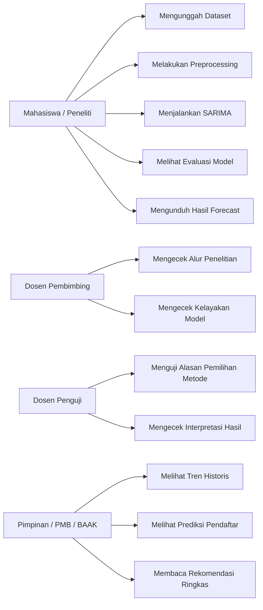

---

## 7. Kebutuhan Data

### 7.1 Format Data Ideal

Format data ideal adalah data transaksi pendaftaran yang memiliki minimal kolom berikut:

| Kolom | Tipe Data | Wajib | Contoh | Keterangan |
|---|---|---|---|---|
| tanggal_daftar | date/datetime | Ya | 2024-03-15 | Tanggal pendaftar melakukan pendaftaran |
| prodi | string | Ya | Informatika | Program studi tujuan |
| status | string | Disarankan | Diterima | Status pendaftaran/diterima/registrasi |
| jalur_masuk | string | Opsional | Reguler | Jalur pendaftaran |
| fakultas | string | Opsional | Sains dan Teknologi | Fakultas |
| tahun_akademik | string | Opsional | 2024/2025 | Tahun akademik |
| jumlah | number | Opsional | 1 | Jika data sudah agregat |

Jika data masih per mahasiswa, maka setiap baris dianggap bernilai 1 pendaftar. Jika data sudah agregat, kolom `jumlah` dipakai sebagai target.

### 7.2 Format Data Agregat Bulanan

| periode | prodi | jumlah_pendaftar |
|---|---|---:|
| 2021-01 | Informatika | 10 |
| 2021-02 | Informatika | 18 |
| 2021-03 | Informatika | 24 |

Format ini paling mudah digunakan untuk dashboard SARIMA.

### 7.3 Format Data Tahunan

| tahun | prodi | jumlah_pendaftar |
|---:|---|---:|
| 2021 | Informatika | 40 |
| 2022 | Informatika | 58 |
| 2023 | Informatika | 71 |
| 2024 | Informatika | 95 |
| 2025 | Informatika | 101 |

Format ini tetap bisa divisualisasikan, tetapi tidak ideal untuk SARIMA musiman jika observasinya hanya 5 tahun.

---

## 8. Aturan Validasi Dataset

Sistem harus melakukan validasi sebelum model dijalankan.

| Pemeriksaan | Syarat | Jika Gagal |
|---|---|---|
| Dataset tidak kosong | Minimal 1 baris | Tampilkan pesan error |
| Kolom waktu tersedia | Ada kolom tanggal/periode/tahun | User diminta memilih kolom waktu |
| Kolom target tersedia | Ada kolom jumlah atau bisa dihitung | User diminta memilih target |
| Tanggal valid | Bisa dikonversi ke datetime | Baris invalid dihapus/diberi peringatan |
| Target numerik | Bisa dikonversi ke angka | Baris invalid dihapus/diberi peringatan |
| Duplikasi periode | Tidak boleh ganda setelah agregasi | Data digabungkan dengan sum/mean |
| Missing value | Tidak ada pada series akhir | Interpolasi/drop/isi 0 sesuai konteks |
| Jumlah observasi | Sesuai minimal metode | Dashboard memberi peringatan |
| Seasonal period | Sesuai frekuensi data | Jika tidak sesuai, user diminta revisi parameter |

---

## 9. Aturan Kelayakan SARIMA

### 9.1 Minimal Observasi yang Disarankan

| Frekuensi Data | Seasonal Period | Minimal Data Aman | Catatan |
|---|---:|---:|---|
| Tahunan | 0 atau tidak musiman | 8–10 tahun | Lebih cocok ARIMA/tren jika kurang |
| Bulanan | 12 | 24–36 bulan | Lebih baik 48–60 bulan |
| Mingguan | 52 | 104 minggu | Minimal dua siklus tahunan |
| Harian | 7 | 56 hari | Untuk pola mingguan |
| Harian | 365 | 730 hari | Untuk pola tahunan, butuh data sangat panjang |

### 9.2 Aturan Keputusan Sistem

Sistem sebaiknya menampilkan pesan:

| Kondisi | Keputusan |
|---|---|
| Observasi < 10 | SARIMA tidak direkomendasikan, tampilkan baseline/tren |
| Data tahunan 5 periode | Tampilkan warning metodologi |
| Data bulanan >= 24 | SARIMA boleh dicoba |
| Data bulanan >= 36 | SARIMA lebih aman |
| Banyak nilai 0 | Hindari MAPE murni, gunakan MAE/RMSE/SMAPE |
| ADF p-value >= 0.05 | Lakukan differencing |
| Residual masih berpola | Model perlu disesuaikan |

---

## 10. Flow Penelitian

Flow penelitian mengikuti alur ilmiah dari identifikasi masalah sampai evaluasi sistem.

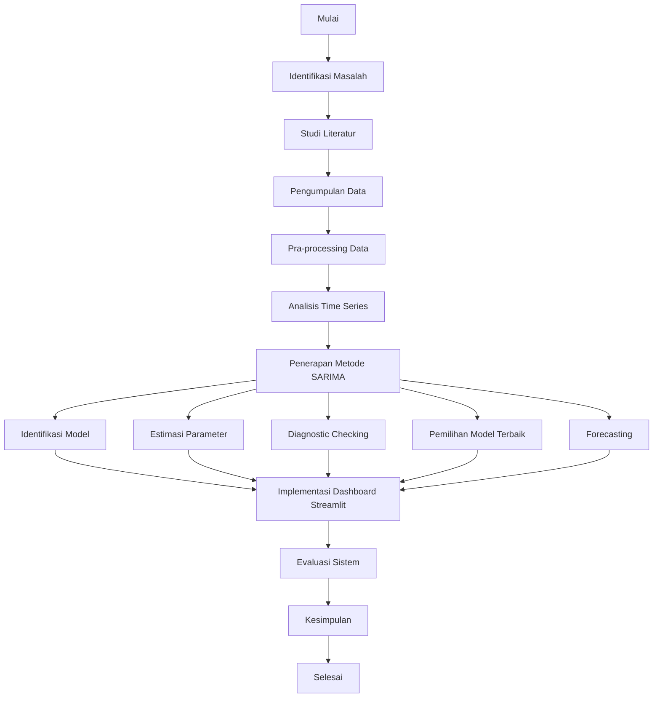

### Penjelasan Flow Penelitian

#### 10.1 Identifikasi Masalah

Tahap ini bertujuan merumuskan masalah utama, yaitu perubahan jumlah pendaftar pada masing-masing jurusan dari waktu ke waktu. Masalah ini penting karena fluktuasi minat jurusan dapat memengaruhi:

1. perencanaan kuota,
2. strategi promosi,
3. pengelolaan sumber daya akademik,
4. evaluasi daya tarik program studi.

#### 10.2 Studi Literatur

Tahap ini digunakan untuk memperkuat alasan penggunaan time series, SARIMA, evaluasi model, dan dashboard Streamlit. Studi literatur juga menjadi dasar untuk menjelaskan:

1. konsep prediksi,
2. konsep tren minat jurusan,
3. data deret waktu,
4. SARIMA,
5. dashboard interaktif,
6. evaluasi model.

#### 10.3 Pengumpulan Data

Data dikumpulkan dari BAAK/PMB atau dokumen resmi universitas. Data sebaiknya mencakup:

1. periode pendaftaran,
2. program studi,
3. jumlah pendaftar,
4. status pendaftaran,
5. jalur masuk jika tersedia.

#### 10.4 Pra-processing Data

Data dibersihkan agar siap digunakan oleh model. Prosesnya meliputi:

1. membaca file,
2. memilih kolom penting,
3. menghapus data kosong,
4. menghapus/menggabungkan duplikasi,
5. mengonversi tanggal,
6. mengagregasi jumlah pendaftar per periode,
7. membuat deret waktu yang konsisten.

#### 10.5 Analisis Time Series

Tahap ini digunakan untuk memahami karakteristik data:

1. tren naik/turun,
2. pola musiman,
3. fluktuasi,
4. kestasioneran,
5. autokorelasi.

#### 10.6 Penerapan SARIMA

Tahap ini membangun model SARIMA melalui:

1. identifikasi parameter,
2. estimasi parameter,
3. diagnostic checking,
4. pemilihan model terbaik,
5. forecasting.

#### 10.7 Implementasi Dashboard Streamlit

Hasil analisis dan model dimasukkan ke dalam dashboard agar pengguna dapat melihat proses dan hasil secara interaktif.

#### 10.8 Evaluasi Sistem

Evaluasi dilakukan dari dua sisi:

1. evaluasi model forecasting,
2. evaluasi fungsionalitas dashboard.

---

## 11. Flow Sistem Dashboard

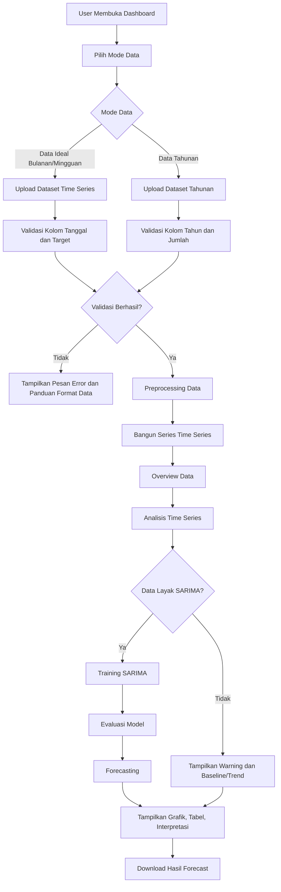

### Penjelasan Flow Sistem

1. User membuka dashboard Streamlit.
2. User memilih mode data.
3. User mengunggah dataset.
4. Sistem melakukan validasi struktur data.
5. Jika data tidak valid, sistem menampilkan pesan error.
6. Jika data valid, sistem melakukan preprocessing.
7. Sistem membentuk deret waktu.
8. Sistem menampilkan overview dan analisis.
9. Sistem mengecek kelayakan data untuk SARIMA.
10. Jika data layak, sistem menjalankan SARIMA.
11. Jika data belum layak, sistem memberi peringatan dan menampilkan baseline/tren.
12. Sistem menampilkan hasil forecast dalam grafik dan tabel.
13. User dapat mengunduh hasil forecast.

---

## 12. Flow Preprocessing Data

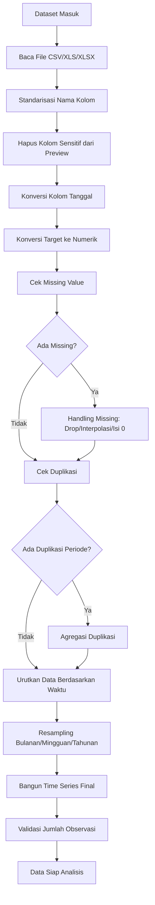

### Penjelasan Preprocessing

#### 12.1 Membaca File

Dashboard harus bisa membaca:

1. `.csv`,
2. `.xls`,
3. `.xlsx`.

#### 12.2 Standarisasi Nama Kolom

Kolom yang memiliki nama tidak konsisten perlu distandarkan. Contoh:

| Kolom Asli | Kolom Standar |
|---|---|
| Tanggal Daftar | tanggal_daftar |
| TGL_DAFTAR | tanggal_daftar |
| Program Studi | prodi |
| Jurusan | prodi |
| Jumlah Pendaftar | jumlah_pendaftar |

#### 12.3 Privasi Data

Jika data berisi identitas mahasiswa, dashboard tidak perlu menampilkan kolom sensitif pada preview utama.

Kolom sensitif yang sebaiknya disembunyikan:

1. nama,
2. NIM,
3. NIK,
4. nomor HP,
5. email,
6. alamat,
7. password,
8. UUID pribadi.

Dashboard hanya perlu data agregat untuk forecasting.

#### 12.4 Agregasi Data

Jika data masih per mahasiswa, maka jumlah pendaftar dihitung dengan:

```text
group by periode + prodi
count jumlah baris
```

Jika data sudah memiliki kolom jumlah, maka dihitung dengan:

```text
group by periode + prodi
sum jumlah
```

#### 12.5 Resampling

Jika data menggunakan tanggal lengkap, data dapat diubah menjadi:

| Frekuensi | Kode Pandas | Keterangan |
|---|---|---|
| Harian | D | Per hari |
| Mingguan | W | Per minggu |
| Bulanan | M atau MS | Per bulan |
| Kuartal | Q | Per kuartal |
| Tahunan | Y atau A | Per tahun |

Untuk SARIMA pada data pendaftaran mahasiswa, frekuensi bulanan biasanya lebih realistis.

---

## 13. Flow Analisis Time Series

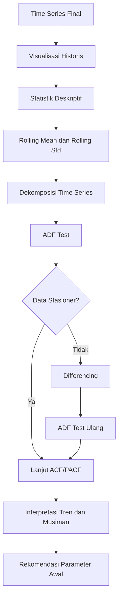

### Penjelasan Analisis Time Series

#### 13.1 Visualisasi Historis

Grafik historis digunakan untuk melihat pola awal:

1. apakah jumlah pendaftar meningkat,
2. apakah menurun,
3. apakah stabil,
4. apakah ada lonjakan tertentu,
5. apakah ada pola berulang.

#### 13.2 Statistik Deskriptif

Statistik yang ditampilkan:

1. jumlah data,
2. rata-rata,
3. median,
4. nilai minimum,
5. nilai maksimum,
6. standar deviasi.

#### 13.3 Rolling Mean dan Rolling Standard Deviation

Rolling mean membantu melihat tren halus. Rolling standard deviation membantu melihat perubahan volatilitas.

Contoh:

```text
Data bulanan → window = 12
Data mingguan → window = 4 atau 52
Data tahunan → window = 2 atau 3, tetapi interpretasinya terbatas
```

#### 13.4 Dekomposisi Time Series

Dekomposisi memisahkan data menjadi:

1. trend,
2. seasonal,
3. residual.

Catatan: dekomposisi musiman sebaiknya dilakukan jika data memiliki minimal dua siklus musiman.

#### 13.5 ADF Test

ADF test digunakan untuk menguji stasioneritas.

Aturan sederhana:

| p-value | Keputusan |
|---:|---|
| < 0.05 | Data dianggap stasioner |
| >= 0.05 | Data belum stasioner |

Jika data belum stasioner, perlu dilakukan differencing.

---

## 14. Flow Pemodelan SARIMA

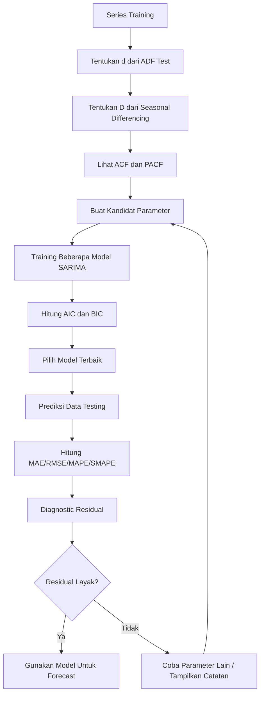

### Penjelasan Pemodelan SARIMA

Model SARIMA ditulis sebagai:

```text
SARIMA(p, d, q)(P, D, Q, s)
```

| Parameter | Keterangan |
|---|---|
| p | orde autoregressive non-musiman |
| d | differencing non-musiman |
| q | orde moving average non-musiman |
| P | orde autoregressive musiman |
| D | differencing musiman |
| Q | orde moving average musiman |
| s | panjang periode musiman |

Contoh untuk data bulanan:

```text
SARIMA(1,1,1)(1,1,1,12)
```

Artinya:

1. komponen non-musiman menggunakan p=1, d=1, q=1,
2. komponen musiman menggunakan P=1, D=1, Q=1,
3. pola musiman dianggap berulang setiap 12 bulan.

---

## 15. Strategi Pemilihan Parameter

### 15.1 Strategi Manual

Parameter dipilih berdasarkan ACF dan PACF.

| Komponen | Sumber Analisis |
|---|---|
| p | PACF non-musiman |
| q | ACF non-musiman |
| P | PACF pada lag musiman |
| Q | ACF pada lag musiman |
| d | ADF test dan differencing |
| D | seasonal differencing |

Kelebihan:

1. lebih mudah dijelaskan saat sidang,
2. menunjukkan proses akademik,
3. tidak terlalu bergantung pada otomatisasi.

Kekurangan:

1. interpretasi ACF/PACF bisa subjektif,
2. kurang praktis jika banyak prodi.

### 15.2 Strategi Auto Search Berdasarkan AIC/BIC

Sistem mencoba beberapa kombinasi parameter lalu memilih model dengan AIC/BIC terkecil.

Contoh ruang pencarian:

```text
p = 0..2
d = 0..1
q = 0..2
P = 0..1
D = 0..1
Q = 0..1
s = 12
```

Kelebihan:

1. lebih otomatis,
2. cocok untuk dashboard,
3. bisa membandingkan beberapa kandidat model.

Kekurangan:

1. lebih lambat,
2. bisa gagal jika data terlalu sedikit,
3. perlu pembatasan parameter.

### 15.3 Rekomendasi Final

Gunakan kombinasi:

```text
ACF/PACF untuk penjelasan akademik
+
AIC/BIC untuk pemilihan model terbaik
```

Dengan cara ini, dashboard tetap kuat untuk sidang dan tetap praktis untuk implementasi.

---

## 16. Flow Evaluasi Model

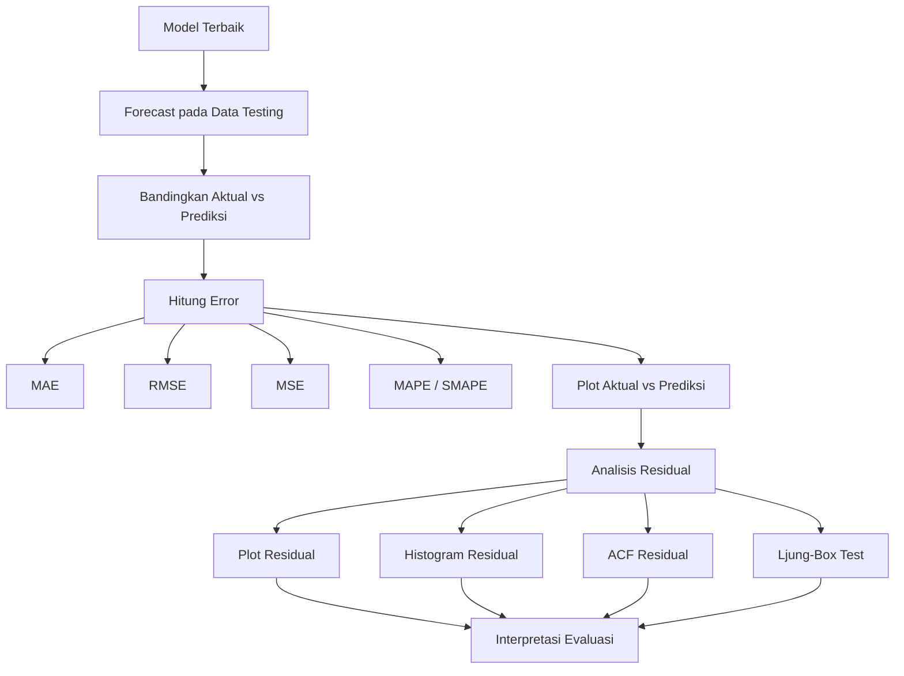

### Penjelasan Evaluasi

#### 16.1 MAE

MAE mengukur rata-rata kesalahan absolut.

```text
MAE kecil → prediksi lebih dekat dengan aktual
```

#### 16.2 MSE

MSE menghitung rata-rata kuadrat error. MSE memberi penalti besar untuk kesalahan besar.

#### 16.3 RMSE

RMSE adalah akar dari MSE. Nilainya kembali ke satuan asli data.

#### 16.4 MAPE

MAPE menunjukkan rata-rata persentase error.

Catatan: MAPE tidak cocok jika data memiliki nilai aktual nol atau sangat kecil.

#### 16.5 SMAPE

SMAPE bisa menjadi alternatif jika data memiliki nilai kecil atau nol.

#### 16.6 AIC dan BIC

AIC dan BIC digunakan untuk membandingkan model. Nilai yang lebih kecil biasanya lebih baik, tetapi tetap harus dilihat bersama evaluasi error dan residual.

#### 16.7 Residual

Residual adalah:

```text
Residual = Aktual - Prediksi
```

Residual yang baik idealnya:

1. menyebar acak,
2. rata-rata mendekati nol,
3. tidak memiliki autokorelasi kuat,
4. tidak membentuk pola tertentu.

---

## 17. Flow Forecasting

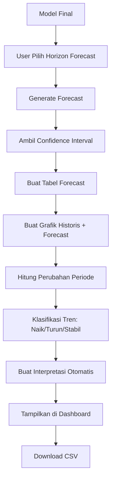

### Penjelasan Forecasting

Output forecasting harus mencakup:

| Kolom | Keterangan |
|---|---|
| periode | Periode prediksi |
| forecast | Nilai prediksi |
| lower_bound | Batas bawah confidence interval |
| upper_bound | Batas atas confidence interval |
| perubahan | Selisih forecast dengan periode sebelumnya |
| persen_perubahan | Persentase perubahan |
| kategori_tren | Naik, turun, atau stabil |

Contoh tabel:

| Periode | Forecast | Lower Bound | Upper Bound | Tren |
|---|---:|---:|---:|---|
| 2026-01 | 95 | 80 | 110 | Naik |
| 2026-02 | 102 | 86 | 118 | Naik |
| 2026-03 | 98 | 82 | 115 | Turun ringan |

---

## 18. Arsitektur Sistem

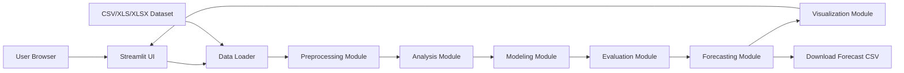

### Penjelasan Arsitektur

#### 18.1 Streamlit UI

Bertugas menampilkan:

1. sidebar,
2. halaman dashboard,
3. tabel,
4. grafik,
5. metric card,
6. tombol download.

#### 18.2 Data Loader

Bertugas membaca file CSV/Excel.

#### 18.3 Preprocessing Module

Bertugas membersihkan data dan membangun time series.

#### 18.4 Analysis Module

Bertugas membuat analisis statistik, ADF test, ACF/PACF, dan decomposition.

#### 18.5 Modeling Module

Bertugas menjalankan SARIMA.

#### 18.6 Evaluation Module

Bertugas menghitung error dan diagnostic residual.

#### 18.7 Forecasting Module

Bertugas membuat prediksi masa depan.

#### 18.8 Visualization Module

Bertugas membuat grafik historis, forecast, residual, dan actual vs predicted.

---

## 19. Struktur Folder Project

Struktur project yang direkomendasikan:

```text
dashboard-sarima-mahasiswa/
│
├── app.py
├── requirements.txt
├── README.md
│
├── data/
│   ├── raw/
│   │   └── data_pendaftaran_mentah.xlsx
│   ├── processed/
│   │   └── data_pendaftaran_bulanan.csv
│   └── sample/
│       └── sample_pendaftaran_bulanan.csv
│
├── src/
│   ├── __init__.py
│   ├── data_loader.py
│   ├── preprocessing.py
│   ├── validation.py
│   ├── analysis.py
│   ├── modeling.py
│   ├── evaluation.py
│   ├── forecasting.py
│   ├── visualization.py
│   └── interpretation.py
│
├── pages/
│   ├── 1_Overview.py
│   ├── 2_Data_Preprocessing.py
│   ├── 3_Analisis_Time_Series.py
│   ├── 4_Pemodelan_SARIMA.py
│   ├── 5_Evaluasi_Diagnostik.py
│   ├── 6_Forecasting_Interpretasi.py
│   └── 7_Kesimpulan.py
│
├── assets/
│   ├── logo.png
│   └── style.css
│
└── outputs/
    ├── hasil_forecast.csv
    └── grafik_forecast.png
```

Jika ingin versi sederhana, seluruh halaman bisa dibuat dalam satu `app.py`. Namun, untuk tugas akhir, struktur modular lebih rapi dan mudah dijelaskan.

---

## 20. Desain Navigasi Dashboard

Navigasi menggunakan sidebar.

```text
Sidebar
├── Mode Data
│   ├── Data Time Series Ideal
│   └── Data Tahunan
│
├── Upload Dataset
│
├── Filter
│   ├── Prodi
│   ├── Fakultas
│   ├── Jalur Masuk
│   └── Status Pendaftaran
│
├── Pengaturan Time Series
│   ├── Kolom Tanggal
│   ├── Kolom Target
│   ├── Frekuensi Resampling
│   └── Agregasi
│
├── Parameter Model
│   ├── Seasonal Period
│   ├── Horizon Forecast
│   ├── Test Size
│   └── Batas Parameter
│
└── Menu Halaman
    ├── Overview
    ├── Data & Preprocessing
    ├── Analisis Time Series
    ├── Pemodelan SARIMA
    ├── Evaluasi & Diagnostik
    ├── Forecasting & Interpretasi
    └── Kesimpulan
```

---

## 21. Flow Navigasi Halaman

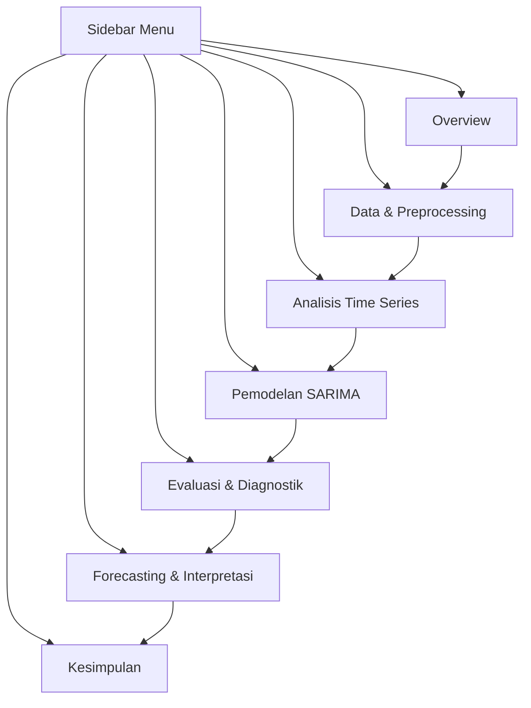

Navigasi boleh bebas melalui sidebar, tetapi urutan presentasi saat sidang sebaiknya mengikuti flow dari atas ke bawah.

---

## 22. Desain Halaman 1 — Overview Penelitian

### 22.1 Tujuan Halaman

Halaman ini berfungsi sebagai halaman pembuka untuk memberikan gambaran umum penelitian.

Halaman ini menjawab:

1. Penelitian ini tentang apa?
2. Data apa yang digunakan?
3. Periode data berapa?
4. Target yang diprediksi apa?
5. Metode yang digunakan apa?
6. Bagaimana hasil ringkasnya?

### 22.2 Komponen Halaman

| Komponen | Isi |
|---|---|
| Judul | Dashboard Forecasting Tren Minat Jurusan Mahasiswa Baru |
| Deskripsi | Penjelasan singkat tujuan dashboard |
| Metric card | Total observasi, periode awal, periode akhir, nilai terakhir |
| Metric evaluasi | MAE/RMSE/MAPE jika model sudah jalan |
| Grafik utama | Historis + forecast ringkas |
| Catatan data | Apakah data layak SARIMA atau belum |
| Insight ringkas | Tren naik/turun/stabil |

### 22.3 Wireframe

```text
+------------------------------------------------------+
| Dashboard Forecasting Tren Minat Jurusan Mahasiswa   |
| Deskripsi singkat penelitian                         |
+------------------------------------------------------+

+-------------+-------------+-------------+-------------+
| Observasi   | Periode Awal| Periode Akhir| Nilai Akhir|
+-------------+-------------+-------------+-------------+

+------------------------------------------------------+
| Grafik Historis + Forecast Ringkas                   |
+------------------------------------------------------+

+------------------------------------------------------+
| Insight: Tren pendaftar menunjukkan ...              |
| Catatan: Data saat ini ...                           |
+------------------------------------------------------+
```

### 22.4 Interpretasi yang Ditampilkan

Contoh:

> Berdasarkan data historis, jumlah pendaftar pada program studi yang dipilih menunjukkan kecenderungan meningkat. Dashboard ini menggunakan pendekatan time series untuk menganalisis pola historis dan menghasilkan prediksi periode mendatang.

Jika data tidak cukup:

> Data yang tersedia masih terbatas, sehingga hasil forecast bersifat indikatif. Untuk pemodelan SARIMA yang lebih kuat, diperlukan data bulanan atau mingguan dengan jumlah observasi lebih panjang.

---

## 23. Desain Halaman 2 — Data & Preprocessing

### 23.1 Tujuan Halaman

Halaman ini menunjukkan bahwa data sudah diproses sebelum digunakan.

Halaman ini menjawab:

1. Bagaimana bentuk data mentah?
2. Kolom apa saja yang digunakan?
3. Apakah ada missing value?
4. Apakah ada duplikasi?
5. Bagaimana data diagregasi?
6. Bagaimana data akhir time series terbentuk?

### 23.2 Komponen Halaman

| Komponen | Isi |
|---|---|
| Upload file | CSV/XLS/XLSX |
| Preview data | Data mentah yang sudah disaring dari kolom sensitif |
| Info kolom | Nama kolom, tipe data |
| Missing value | Jumlah missing tiap kolom |
| Duplikasi | Jumlah duplikasi |
| Agregasi | Periode + prodi + jumlah |
| Data bersih | Time series final |
| Narasi preprocessing | Ringkasan proses cleaning |

### 23.3 Wireframe

```text
+------------------------------------------------------+
| Data & Preprocessing                                 |
+------------------------------------------------------+

[Upload Dataset]

+------------------------------------------------------+
| Preview Data Mentah                                  |
+------------------------------------------------------+

+-------------+-------------+-------------+-------------+
| Baris Data  | Kolom Data  | Missing     | Duplikasi   |
+-------------+-------------+-------------+-------------+

+------------------------------------------------------+
| Tabel Missing Value                                  |
+------------------------------------------------------+

+------------------------------------------------------+
| Time Series Setelah Preprocessing                    |
+------------------------------------------------------+

+------------------------------------------------------+
| Catatan Preprocessing                                |
+------------------------------------------------------+
```

### 23.4 Output Preprocessing

Output akhir halaman ini adalah data time series:

| Periode | Prodi | Jumlah Pendaftar |
|---|---|---:|
| 2021-01 | Informatika | 12 |
| 2021-02 | Informatika | 18 |
| 2021-03 | Informatika | 25 |

---

## 24. Desain Halaman 3 — Analisis Time Series

### 24.1 Tujuan Halaman

Halaman ini digunakan untuk memahami karakteristik data sebelum masuk ke model.

Halaman ini menjawab:

1. Apakah data memiliki tren?
2. Apakah data memiliki pola musiman?
3. Apakah data stasioner?
4. Apakah perlu differencing?
5. Bagaimana ACF dan PACF data?

### 24.2 Komponen Halaman

| Komponen | Isi |
|---|---|
| Grafik historis | Line chart jumlah pendaftar |
| Statistik deskriptif | Mean, min, max, std |
| Rolling mean/std | Melihat tren dan volatilitas |
| Decomposition | Trend, seasonal, residual |
| ADF test | Statistik dan p-value |
| ACF/PACF | Grafik korelasi |
| Interpretasi | Narasi pola data |

### 24.3 Wireframe

```text
+------------------------------------------------------+
| Analisis Time Series                                 |
+------------------------------------------------------+

+------------------------------------------------------+
| Grafik Historis                                      |
+------------------------------------------------------+

+----------------------+------------------------------+
| Statistik Deskriptif | ADF Test                      |
+----------------------+------------------------------+

+------------------------------------------------------+
| Rolling Mean & Rolling Standard Deviation            |
+------------------------------------------------------+

+------------------------------------------------------+
| Decomposition: Trend / Seasonal / Residual           |
+------------------------------------------------------+

+----------------------+------------------------------+
| ACF                  | PACF                          |
+----------------------+------------------------------+

+------------------------------------------------------+
| Interpretasi Pola Data                               |
+------------------------------------------------------+
```

### 24.4 Interpretasi yang Ditampilkan

Contoh jika data naik:

> Grafik historis menunjukkan adanya kecenderungan peningkatan jumlah pendaftar dari waktu ke waktu. Hal ini menunjukkan bahwa minat terhadap program studi yang dipilih cenderung meningkat.

Contoh jika ADF tidak stasioner:

> Nilai p-value ADF lebih besar dari 0,05 sehingga data belum stasioner. Oleh karena itu, proses differencing diperlukan sebelum model SARIMA dibangun.

---

## 25. Desain Halaman 4 — Pemodelan SARIMA

### 25.1 Tujuan Halaman

Halaman ini menjelaskan proses pembentukan model SARIMA.

Halaman ini menjawab:

1. Parameter apa yang digunakan?
2. Bagaimana data training dan testing dibagi?
3. Bagaimana model terbaik dipilih?
4. Berapa nilai AIC dan BIC?
5. Apakah model berhasil dilatih?

### 25.2 Komponen Halaman

| Komponen | Isi |
|---|---|
| Penjelasan SARIMA | Ringkas dan mudah dipahami |
| Parameter input | p,d,q,P,D,Q,s |
| Train-test split | Jumlah data train dan test |
| Auto search | Kandidat parameter |
| Model terbaik | Parameter final |
| AIC/BIC | Nilai model |
| Model summary | Dalam expander |
| Catatan kelayakan data | Warning jika data pendek |

### 25.3 Wireframe

```text
+------------------------------------------------------+
| Pemodelan SARIMA                                     |
+------------------------------------------------------+

+------------------------------------------------------+
| Penjelasan Singkat SARIMA                            |
+------------------------------------------------------+

+----------------------+------------------------------+
| Parameter Model      | Train-Test Split              |
+----------------------+------------------------------+

+------------------------------------------------------+
| Tabel Kandidat Model dan AIC/BIC                     |
+------------------------------------------------------+

+------------------------------------------------------+
| Model Terbaik                                        |
| SARIMA(p,d,q)(P,D,Q,s)                               |
+------------------------------------------------------+

[Expander: Ringkasan Model]
```

### 25.4 Catatan untuk Data Tahunan

Jika data hanya 5 tahun:

> Jumlah observasi terlalu sedikit untuk membangun SARIMA musiman yang stabil. Dashboard tetap dapat menampilkan analisis tren, tetapi hasil pemodelan SARIMA perlu diperlakukan sebagai eksplorasi awal, bukan kesimpulan akurasi yang kuat.

---

## 26. Desain Halaman 5 — Evaluasi & Diagnostik Model

### 26.1 Tujuan Halaman

Halaman ini membuktikan apakah model cukup layak.

Halaman ini menjawab:

1. Seberapa besar error model?
2. Apakah prediksi mengikuti data aktual?
3. Apakah residual masih berpola?
4. Apakah model bisa digunakan untuk forecast?

### 26.2 Komponen Halaman

| Komponen | Isi |
|---|---|
| Metric card | MAE, MSE, RMSE, MAPE/SMAPE |
| Grafik aktual vs prediksi | Perbandingan data testing |
| Tabel evaluasi | Nilai metrik |
| Residual plot | Error terhadap waktu |
| Histogram residual | Distribusi error |
| ACF residual | Autokorelasi residual |
| Ljung-Box | Uji residual white noise |
| Interpretasi | Kesimpulan performa model |

### 26.3 Wireframe

```text
+------------------------------------------------------+
| Evaluasi & Diagnostik Model                          |
+------------------------------------------------------+

+-------------+-------------+-------------+-------------+
| MAE         | RMSE        | MSE         | MAPE/SMAPE  |
+-------------+-------------+-------------+-------------+

+------------------------------------------------------+
| Grafik Aktual vs Prediksi                            |
+------------------------------------------------------+

+----------------------+------------------------------+
| Residual Plot        | Histogram Residual            |
+----------------------+------------------------------+

+----------------------+------------------------------+
| ACF Residual         | Ljung-Box Test                 |
+----------------------+------------------------------+

+------------------------------------------------------+
| Interpretasi Evaluasi                                |
+------------------------------------------------------+
```

---

## 27. Desain Halaman 6 — Forecasting & Interpretasi

### 27.1 Tujuan Halaman

Halaman ini menampilkan hasil akhir prediksi.

Halaman ini menjawab:

1. Berapa prediksi periode berikutnya?
2. Apakah prediksi naik, turun, atau stabil?
3. Seberapa besar ketidakpastian prediksi?
4. Apa makna hasil forecast bagi PMB dan prodi?

### 27.2 Komponen Halaman

| Komponen | Isi |
|---|---|
| Input horizon | Jumlah periode forecast |
| Grafik forecast | Historis + forecast + confidence interval |
| Tabel forecast | Forecast, lower, upper |
| Perubahan | Selisih antarperiode |
| Kategori tren | Naik/turun/stabil |
| Interpretasi | Narasi hasil prediksi |
| Download | CSV hasil forecast |

### 27.3 Wireframe

```text
+------------------------------------------------------+
| Forecasting & Interpretasi                           |
+------------------------------------------------------+

[Slider Horizon Forecast]

+------------------------------------------------------+
| Grafik Historis + Forecast + Confidence Interval     |
+------------------------------------------------------+

+------------------------------------------------------+
| Tabel Hasil Forecast                                 |
+------------------------------------------------------+

[Download Hasil Forecast CSV]

+------------------------------------------------------+
| Interpretasi Hasil Forecast                          |
+------------------------------------------------------+
```

### 27.4 Contoh Narasi

Jika forecast naik:

> Hasil forecast menunjukkan kecenderungan peningkatan jumlah pendaftar pada beberapa periode mendatang. Hal ini dapat menjadi sinyal positif bagi program studi dan dapat digunakan sebagai pertimbangan dalam perencanaan kuota serta strategi promosi.

Jika forecast turun:

> Hasil forecast menunjukkan kecenderungan penurunan jumlah pendaftar. Kondisi ini perlu diperhatikan sebagai bahan evaluasi strategi promosi dan daya tarik program studi.

Jika forecast stabil:

> Hasil forecast menunjukkan jumlah pendaftar relatif stabil. Hal ini menunjukkan pola historis tidak mengalami perubahan besar pada horizon prediksi yang dipilih.

---

## 28. Desain Halaman 7 — Kesimpulan / Rekomendasi

### 28.1 Tujuan Halaman

Halaman ini merangkum hasil penelitian.

Halaman ini menjawab:

1. Apa kesimpulan dari data?
2. Apa kesimpulan dari model?
3. Apa kesimpulan dari forecast?
4. Apa keterbatasan penelitian?
5. Apa rekomendasi pengembangan?

### 28.2 Komponen Halaman

| Komponen | Isi |
|---|---|
| Kesimpulan data | Pola historis |
| Kesimpulan model | Model terbaik dan evaluasi |
| Kesimpulan forecast | Tren masa depan |
| Keterbatasan | Data, variabel, metode |
| Rekomendasi | Data lebih panjang, variabel eksternal, metode pembanding |

### 28.3 Wireframe

```text
+------------------------------------------------------+
| Kesimpulan / Rekomendasi                             |
+------------------------------------------------------+

1. Kesimpulan Data
2. Kesimpulan Model
3. Kesimpulan Forecast
4. Keterbatasan Penelitian
5. Saran Pengembangan
```

---

## 29. Desain Data Model

Meskipun dashboard tidak harus memakai database, struktur data tetap perlu dirancang.

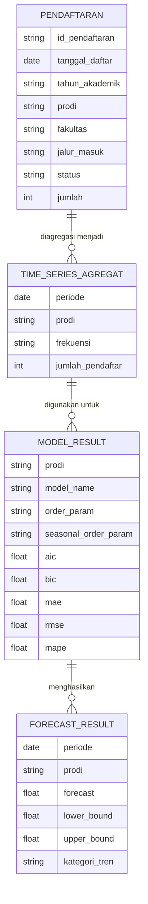

---

## 30. Data Dictionary

### 30.1 Dataset Pendaftaran Mentah

| Kolom | Tipe | Wajib | Keterangan |
|---|---|---|---|
| id_pendaftaran | string | Tidak | ID unik data |
| tanggal_daftar | datetime | Ya | Tanggal pendaftaran |
| tahun_akademik | string | Tidak | Tahun akademik |
| prodi | string | Ya | Program studi |
| fakultas | string | Tidak | Fakultas |
| jalur_masuk | string | Tidak | Jalur masuk |
| status | string | Disarankan | Status pendaftar |
| jumlah | integer | Tidak | Jika data sudah agregat |

### 30.2 Dataset Time Series Final

| Kolom | Tipe | Wajib | Keterangan |
|---|---|---|---|
| periode | datetime | Ya | Periode hasil agregasi |
| prodi | string | Ya | Program studi |
| jumlah_pendaftar | integer/float | Ya | Target forecasting |

### 30.3 Dataset Hasil Forecast

| Kolom | Tipe | Keterangan |
|---|---|---|
| periode | datetime | Periode prediksi |
| forecast | float | Nilai prediksi |
| lower_bound | float | Batas bawah |
| upper_bound | float | Batas atas |
| perubahan | float | Selisih dari periode sebelumnya |
| persen_perubahan | float | Persentase perubahan |
| kategori_tren | string | Naik/turun/stabil |

---

## 31. Rancangan Sidebar

### 31.1 Komponen Sidebar

| Komponen | Tipe | Keterangan |
|---|---|---|
| Mode data | radio | Data ideal atau data tahunan |
| Upload file | file uploader | CSV/XLS/XLSX |
| Pilih halaman | radio/selectbox | Navigasi dashboard |
| Pilih prodi | selectbox/multiselect | Filter program studi |
| Pilih status | selectbox | Daftar/diterima/registrasi |
| Kolom tanggal | selectbox | Dipilih dari dataset |
| Kolom target | selectbox | Kolom numerik |
| Frekuensi | selectbox | D/W/M/Q/Y |
| Agregasi | selectbox | sum/mean/count |
| Seasonal period | number input | s pada SARIMA |
| Horizon forecast | slider | Jumlah periode prediksi |
| Test size | slider | Jumlah data testing |
| Max parameter | slider | Batas p/q/P/Q |
| Tombol proses | button | Jalankan analisis/model |

### 31.2 Contoh Sidebar

```python
st.sidebar.title("Pengaturan Dashboard")

mode = st.sidebar.radio(
    "Mode Data",
    ["Data Time Series", "Data Tahunan"]
)

uploaded_file = st.sidebar.file_uploader(
    "Upload Dataset",
    type=["csv", "xls", "xlsx"]
)

page = st.sidebar.radio(
    "Pilih Halaman",
    [
        "Overview",
        "Data & Preprocessing",
        "Analisis Time Series",
        "Pemodelan SARIMA",
        "Evaluasi & Diagnostik",
        "Forecasting & Interpretasi",
        "Kesimpulan"
    ]
)

forecast_steps = st.sidebar.slider(
    "Horizon Forecast",
    min_value=1,
    max_value=24,
    value=12
)
```

---

## 32. Rancangan Modul Kode

### 32.1 `data_loader.py`

Fungsi:

1. membaca CSV,
2. membaca Excel,
3. mendeteksi sheet,
4. mengembalikan DataFrame.

Contoh fungsi:

```python
def load_data(uploaded_file):
    if uploaded_file.name.endswith(".csv"):
        return pd.read_csv(uploaded_file)
    return pd.read_excel(uploaded_file)
```

### 32.2 `validation.py`

Fungsi:

1. validasi kolom tanggal,
2. validasi kolom target,
3. validasi jumlah observasi,
4. validasi missing value,
5. membuat pesan warning.

### 32.3 `preprocessing.py`

Fungsi:

1. konversi tanggal,
2. konversi numerik,
3. sort data,
4. agregasi per periode,
5. resampling,
6. handling missing value.

### 32.4 `analysis.py`

Fungsi:

1. statistik deskriptif,
2. rolling mean,
3. decomposition,
4. ADF test,
5. ACF/PACF.

### 32.5 `modeling.py`

Fungsi:

1. train-test split,
2. training SARIMA,
3. auto search,
4. pemilihan model berdasarkan AIC/BIC.

### 32.6 `evaluation.py`

Fungsi:

1. MAE,
2. MSE,
3. RMSE,
4. MAPE,
5. SMAPE,
6. residual diagnostics.

### 32.7 `forecasting.py`

Fungsi:

1. generate forecast,
2. confidence interval,
3. forecast table,
4. tren kategori.

### 32.8 `visualization.py`

Fungsi:

1. grafik historis,
2. grafik forecast,
3. grafik actual vs predicted,
4. grafik residual,
5. decomposition plot.

### 32.9 `interpretation.py`

Fungsi:

1. interpretasi ADF,
2. interpretasi tren,
3. interpretasi evaluasi,
4. interpretasi forecast,
5. interpretasi keterbatasan data.

---

## 33. Pseudocode Pipeline Utama

```python
# 1. User upload dataset
df_raw = load_data(uploaded_file)

# 2. Validasi dataset
validation_result = validate_dataset(df_raw)

if not validation_result["valid"]:
    show_error(validation_result["message"])
    stop()

# 3. Preprocessing
df_clean = preprocess_data(
    df_raw,
    date_col=date_col,
    target_col=target_col,
    group_col=prodi_col,
    freq=freq,
    agg=agg
)

# 4. Bangun time series berdasarkan prodi
series = build_time_series(
    df_clean,
    selected_prodi=selected_prodi,
    date_col="periode",
    target_col="jumlah_pendaftar"
)

# 5. Analisis time series
analysis_result = analyze_time_series(series)

# 6. Cek kelayakan SARIMA
eligibility = check_sarima_eligibility(
    series,
    seasonal_period=s
)

if not eligibility["recommended"]:
    show_warning(eligibility["message"])
    baseline_result = run_baseline(series)
else:
    # 7. Split train-test
    train, test = split_train_test(series, test_size=test_size)

    # 8. Train SARIMA
    model_result = train_sarima_grid_search(
        train,
        seasonal_period=s,
        max_order=max_order
    )

    # 9. Evaluasi
    evaluation = evaluate_model(model_result, test)

    # 10. Forecast
    forecast_df = generate_forecast(
        model_result,
        steps=forecast_steps
    )

# 11. Visualisasi dan interpretasi
show_dashboard_outputs(
    analysis_result,
    model_result,
    evaluation,
    forecast_df
)
```

---

## 34. Rancangan Pesan Warning Sistem

Dashboard harus jujur ketika data tidak ideal.

### 34.1 Warning Data Terlalu Pendek

```text
Data hanya memiliki 5 observasi. Jumlah ini belum cukup untuk membangun model SARIMA musiman yang stabil. Hasil prediksi akan ditampilkan sebagai analisis awal dan perlu ditafsirkan dengan hati-hati.
```

### 34.2 Warning Data Tahunan

```text
Data yang digunakan berbentuk tahunan. Pola musiman sulit dibuktikan karena setiap tahun hanya memiliki satu nilai. Untuk SARIMA yang lebih kuat, gunakan data bulanan atau mingguan.
```

### 34.3 Warning MAPE

```text
MAPE tidak dihitung karena terdapat nilai aktual nol atau sangat kecil. Gunakan MAE, RMSE, atau SMAPE sebagai alternatif evaluasi.
```

### 34.4 Warning Residual

```text
Residual masih menunjukkan pola/autokorelasi. Model kemungkinan belum menangkap seluruh pola data. Coba parameter lain atau pertimbangkan metode pembanding.
```

---

## 35. Rancangan Interpretasi Otomatis

### 35.1 Interpretasi Tren

```text
Jika nilai terakhir > nilai awal:
Data menunjukkan kecenderungan meningkat dari periode awal ke periode akhir.

Jika nilai terakhir < nilai awal:
Data menunjukkan kecenderungan menurun dari periode awal ke periode akhir.

Jika perubahan kecil:
Data menunjukkan kecenderungan relatif stabil.
```

### 35.2 Interpretasi ADF

```text
Jika p-value < 0.05:
Data dapat dianggap stasioner sehingga dapat digunakan untuk pemodelan tanpa differencing tambahan.

Jika p-value >= 0.05:
Data belum stasioner sehingga perlu dilakukan differencing.
```

### 35.3 Interpretasi MAPE

| MAPE | Interpretasi Umum |
|---:|---|
| < 10% | Sangat baik |
| 10%–20% | Baik |
| 20%–50% | Cukup |
| > 50% | Kurang baik |

Catatan: klasifikasi ini bersifat panduan umum dan tetap harus disesuaikan dengan konteks data.

### 35.4 Interpretasi Forecast

```text
Forecast naik:
Hasil prediksi menunjukkan peningkatan jumlah pendaftar pada horizon yang dipilih.

Forecast turun:
Hasil prediksi menunjukkan penurunan jumlah pendaftar pada horizon yang dipilih.

Forecast stabil:
Hasil prediksi menunjukkan pergerakan relatif stabil.
```

---

## 36. Rancangan Output Dashboard

### 36.1 Output Visual

| Output | Halaman |
|---|---|
| Grafik historis | Overview, Analisis |
| Grafik rolling mean/std | Analisis |
| Decomposition plot | Analisis |
| ACF/PACF | Analisis |
| Grafik actual vs predicted | Evaluasi |
| Grafik residual | Evaluasi |
| Grafik forecast + confidence interval | Forecasting |

### 36.2 Output Tabel

| Output | Halaman |
|---|---|
| Preview data | Data & Preprocessing |
| Missing value | Data & Preprocessing |
| Data bersih | Data & Preprocessing |
| Statistik deskriptif | Analisis |
| ADF test | Analisis |
| Kandidat model | Pemodelan |
| Evaluasi model | Evaluasi |
| Hasil forecast | Forecasting |

### 36.3 Output Narasi

| Narasi | Halaman |
|---|---|
| Deskripsi penelitian | Overview |
| Catatan preprocessing | Data & Preprocessing |
| Interpretasi pola data | Analisis |
| Interpretasi parameter model | Pemodelan |
| Interpretasi evaluasi | Evaluasi |
| Interpretasi forecast | Forecasting |
| Kesimpulan | Kesimpulan |

---

## 37. Rancangan Evaluasi Sistem

Evaluasi sistem dibagi menjadi dua jenis:

### 37.1 Evaluasi Model

| Aspek | Indikator |
|---|---|
| Akurasi | MAE, MSE, RMSE, MAPE/SMAPE |
| Kompleksitas model | AIC dan BIC |
| Residual | Plot residual, ACF residual, Ljung-Box |
| Kestabilan | Perbandingan aktual vs prediksi |
| Kelayakan data | Jumlah observasi dan pola musiman |

### 37.2 Evaluasi Dashboard

| Aspek | Indikator |
|---|---|
| Fungsionalitas | Upload data, filter, proses model, download |
| Keterbacaan | Grafik jelas, tabel rapi, narasi mudah dipahami |
| Interaktivitas | Sidebar filter, horizon forecast, pilihan prodi |
| Kecepatan | Proses model tidak terlalu lama |
| Kesesuaian akademik | Menampilkan preprocessing, analisis, evaluasi, dan interpretasi |

---

## 38. Acceptance Criteria

Project dianggap selesai jika memenuhi kriteria berikut.

### 38.1 Kriteria Data

- [ ] Dataset berhasil dibaca.
- [ ] Kolom tanggal/periode valid.
- [ ] Kolom target valid.
- [ ] Missing value dicek.
- [ ] Duplikasi dicek.
- [ ] Data sudah diurutkan berdasarkan waktu.
- [ ] Data sudah diagregasi menjadi time series.
- [ ] Jumlah observasi ditampilkan.
- [ ] Sistem memberi warning jika data tidak ideal.

### 38.2 Kriteria Analisis

- [ ] Grafik historis tersedia.
- [ ] Statistik deskriptif tersedia.
- [ ] Rolling mean/std tersedia.
- [ ] ADF test tersedia.
- [ ] ACF/PACF tersedia.
- [ ] Interpretasi analisis tersedia.
- [ ] Catatan kelayakan SARIMA tersedia.

### 38.3 Kriteria Model

- [ ] Train-test split mengikuti urutan waktu.
- [ ] Parameter SARIMA ditampilkan.
- [ ] AIC/BIC ditampilkan.
- [ ] Model terbaik ditampilkan.
- [ ] Jika data tidak cukup, sistem tidak mengklaim akurasi tinggi.

### 38.4 Kriteria Evaluasi

- [ ] MSE tersedia.
- [ ] RMSE tersedia.
- [ ] MAE tersedia.
- [ ] MAPE/SMAPE tersedia jika memungkinkan.
- [ ] Grafik actual vs predicted tersedia.
- [ ] Diagnostik residual tersedia.
- [ ] Interpretasi evaluasi tersedia.

### 38.5 Kriteria Forecasting

- [ ] Horizon forecast dapat dipilih.
- [ ] Grafik forecast tersedia.
- [ ] Confidence interval tersedia.
- [ ] Tabel forecast tersedia.
- [ ] Download CSV tersedia.
- [ ] Interpretasi hasil tersedia.

### 38.6 Kriteria UI/UX

- [ ] Navigasi mudah digunakan.
- [ ] Tampilan tidak terlalu padat.
- [ ] Grafik mudah dibaca.
- [ ] Tabel rapi.
- [ ] Narasi singkat tetapi jelas.
- [ ] Sidebar terstruktur.

---

## 39. Risiko dan Solusi

| Risiko | Dampak | Solusi |
|---|---|---|
| Data terlalu sedikit | SARIMA tidak stabil | Gunakan data bulanan/mingguan atau tampilkan warning |
| Data hanya tahunan | Seasonality sulit dibuktikan | Fokus pada tren atau ubah data ke bulanan |
| Banyak nilai 0 | MAPE bermasalah | Gunakan MAE/RMSE/SMAPE |
| Data tidak lengkap | Forecast bias | Validasi dan handling missing |
| Model lambat | Dashboard berat | Batasi grid search dan gunakan cache |
| Residual berpola | Model belum optimal | Coba parameter lain atau tampilkan catatan |
| Dashboard terlalu ramai | User bingung | Gunakan halaman terpisah dan expander |
| Interpretasi berlebihan | Kesimpulan tidak valid | Tulis interpretasi hati-hati sesuai data |

---

## 40. Timeline Implementasi

| Tahap | Durasi | Output |
|---|---:|---|
| Setup project | 1 hari | Struktur folder dan Streamlit berjalan |
| Load data | 1 hari | Upload CSV/Excel berfungsi |
| Preprocessing | 1–2 hari | Data bersih dan time series final |
| Analisis time series | 1–2 hari | Grafik, ADF, ACF/PACF |
| SARIMA modeling | 2–3 hari | Model dapat dilatih |
| Evaluasi model | 1–2 hari | Metrik dan residual |
| Forecasting | 1 hari | Grafik dan tabel forecast |
| UI polishing | 1–2 hari | Dashboard rapi |
| Dokumentasi | 1 hari | README dan catatan sidang |

Total realistis: **10–15 hari kerja**, tergantung kualitas data.

---

## 41. Checklist Sebelum Sidang

- [ ] Dashboard bisa dijalankan tanpa error.
- [ ] Dataset berhasil dimuat.
- [ ] Data sensitif tidak ditampilkan berlebihan.
- [ ] Semua halaman bisa dibuka.
- [ ] Grafik historis muncul.
- [ ] ADF test muncul.
- [ ] ACF/PACF muncul.
- [ ] Model dapat dijalankan jika data cukup.
- [ ] Warning muncul jika data tidak cukup.
- [ ] Evaluasi model tersedia.
- [ ] Forecast tersedia.
- [ ] Confidence interval tersedia.
- [ ] Interpretasi tidak bertentangan dengan grafik.
- [ ] Alasan memakai SARIMA dapat dijelaskan.
- [ ] Keterbatasan data dapat dijelaskan.
- [ ] File hasil forecast bisa diunduh.

---

## 42. Pertanyaan Sidang dan Jawaban Singkat

### 42.1 Mengapa menggunakan SARIMA?

Jawaban:

> SARIMA digunakan karena data pendaftaran mahasiswa baru merupakan data deret waktu dan berpotensi memiliki pola tren serta musiman. SARIMA mampu memodelkan komponen non-musiman dan musiman melalui parameter `(p,d,q)` dan `(P,D,Q,s)`.

### 42.2 Apa bedanya ARIMA dan SARIMA?

Jawaban:

> ARIMA memodelkan data time series tanpa komponen musiman eksplisit, sedangkan SARIMA menambahkan komponen musiman sehingga lebih cocok untuk data yang memiliki pola berulang pada periode tertentu.

### 42.3 Bagaimana menentukan parameter SARIMA?

Jawaban:

> Parameter ditentukan melalui kombinasi analisis ACF/PACF, uji stasioneritas, differencing, dan pemilihan model terbaik berdasarkan AIC/BIC serta evaluasi error.

### 42.4 Kenapa data harus stasioner?

Jawaban:

> Data stasioner diperlukan agar hubungan statistik antarperiode lebih stabil dan model time series dapat menghasilkan estimasi yang lebih valid.

### 42.5 Apa arti MAPE?

Jawaban:

> MAPE menunjukkan rata-rata kesalahan prediksi dalam bentuk persentase terhadap nilai aktual. Semakin kecil MAPE, semakin baik performa model, tetapi MAPE tidak ideal jika terdapat nilai aktual nol.

### 42.6 Apa fungsi confidence interval?

Jawaban:

> Confidence interval menunjukkan rentang ketidakpastian dari hasil prediksi. Forecast tidak dianggap sebagai angka pasti, tetapi estimasi dengan batas bawah dan batas atas.

### 42.7 Bagaimana jika data hanya tahunan 2021–2025?

Jawaban:

> Data tahunan 2021–2025 hanya memiliki lima observasi sehingga belum ideal untuk SARIMA musiman. Dashboard tetap dapat menampilkan tren dan analisis awal, tetapi hasil SARIMA harus diberi catatan keterbatasan. Data bulanan atau mingguan lebih disarankan agar pola musiman dapat dianalisis dengan lebih kuat.

---

## 43. Rekomendasi Revisi Metodologi Skripsi

Jika metodologi ingin lebih aman, tambahkan catatan seperti berikut:

> Data pendaftaran mahasiswa baru akan diproses menjadi data deret waktu berdasarkan periode yang tersedia. Apabila data yang diperoleh memiliki tingkat granularitas bulanan atau mingguan, maka pemodelan SARIMA dilakukan dengan mempertimbangkan komponen musiman sesuai periode data. Namun, apabila data yang tersedia hanya berbentuk tahunan dengan jumlah observasi terbatas, maka hasil pemodelan SARIMA diperlakukan sebagai analisis awal dan dilengkapi dengan catatan keterbatasan data agar interpretasi hasil tetap proporsional.

Kalimat ini penting agar penelitian tidak terlihat memaksakan SARIMA ketika data tidak cukup.

---

## 44. Rekomendasi Final

Perancangan dashboard ini sebaiknya diarahkan menjadi:

> **Dashboard Penelitian Forecasting Tren Minat Jurusan Mahasiswa Baru Berbasis Streamlit dengan Metode SARIMA**

Tetapi secara teknis, dashboard harus tetap memiliki validasi metodologi:

1. Jika data bulanan/mingguan tersedia, SARIMA bisa digunakan sebagai metode utama.
2. Jika data hanya tahunan 2021–2025, sistem harus memberi warning bahwa data belum ideal.
3. Dashboard tetap bisa menampilkan tren, evaluasi sederhana, dan forecast indikatif.
4. Klaim akurasi tinggi harus dihindari jika observasi terlalu sedikit.
5. Bagian kesimpulan harus selalu menyebut keterbatasan data.

Dengan rancangan ini, project akan lebih aman untuk tugas akhir karena:

1. flow penelitian jelas,
2. dashboard rapi dan sistematis,
3. metode SARIMA dijelaskan secara akademik,
4. proses preprocessing dan evaluasi terlihat,
5. keterbatasan data tidak disembunyikan,
6. hasil forecast tetap mudah dipahami oleh pengguna.

---

## 45. Lampiran — Contoh Format Dataset yang Direkomendasikan

### 45.1 Dataset Transaksi

```csv
tanggal_daftar,prodi,jalur_masuk,status,tahun_akademik
2021-01-05,Informatika,Reguler,Diterima,2021/2022
2021-01-08,Informatika,Reguler,Diterima,2021/2022
2021-02-02,PGSD,Mandiri,Diterima,2021/2022
2021-02-10,Informatika,Reguler,Diterima,2021/2022
```

### 45.2 Dataset Agregat Bulanan

```csv
periode,prodi,jumlah_pendaftar
2021-01,Informatika,12
2021-02,Informatika,18
2021-03,Informatika,24
2021-04,Informatika,31
```

### 45.3 Dataset Tahunan

```csv
tahun,prodi,jumlah_pendaftar
2021,Informatika,40
2022,Informatika,58
2023,Informatika,71
2024,Informatika,95
2025,Informatika,101
```

---

## 46. Lampiran — Contoh Narasi Dashboard

### 46.1 Narasi Overview

> Dashboard ini digunakan untuk menganalisis dan memprediksi tren minat jurusan mahasiswa baru berdasarkan data historis pendaftaran. Proses analisis dilakukan melalui tahapan preprocessing, analisis time series, pemodelan SARIMA, evaluasi model, dan forecasting. Hasil prediksi disajikan dalam bentuk grafik dan tabel agar mudah dipahami oleh pengguna.

### 46.2 Narasi Preprocessing

> Data telah melalui proses preprocessing yang meliputi pemilihan kolom, konversi tanggal, validasi nilai numerik, pengecekan missing value, pengecekan duplikasi, serta agregasi data berdasarkan periode waktu. Data hasil preprocessing digunakan sebagai input utama dalam analisis time series.

### 46.3 Narasi Analisis

> Hasil visualisasi historis menunjukkan adanya perubahan jumlah pendaftar dari waktu ke waktu. Analisis ini digunakan untuk memahami pola tren, kemungkinan musiman, dan kestasioneran data sebelum model SARIMA dibangun.

### 46.4 Narasi Evaluasi

> Evaluasi model dilakukan dengan membandingkan nilai aktual dan nilai prediksi pada data testing. Metrik evaluasi yang digunakan meliputi MAE, RMSE, MSE, dan MAPE/SMAPE. Selain itu, residual model dianalisis untuk melihat apakah error masih memiliki pola tertentu.

### 46.5 Narasi Forecasting

> Hasil forecasting menunjukkan estimasi jumlah pendaftar pada periode mendatang. Nilai prediksi disertai confidence interval untuk menunjukkan rentang ketidakpastian. Interpretasi hasil digunakan sebagai informasi pendukung dalam perencanaan penerimaan mahasiswa baru.

---

## 47. Lampiran — Flow Lengkap End-to-End

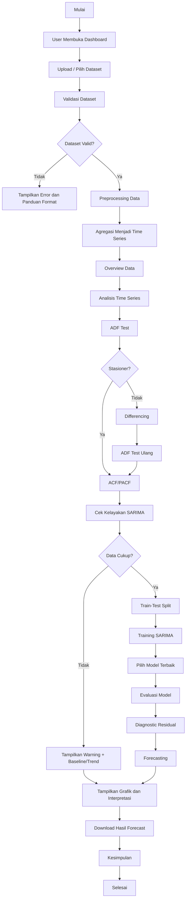

---

## 48. Kesimpulan Dokumen Perancangan

Dokumen ini merancang dashboard secara lengkap mulai dari kebutuhan data, flow penelitian, flow sistem, preprocessing, analisis time series, pemodelan SARIMA, evaluasi, forecasting, struktur halaman, arsitektur sistem, struktur folder, sampai checklist sidang.

Poin paling penting adalah:

1. Dashboard harus mengikuti alur penelitian, bukan hanya menampilkan grafik.
2. SARIMA cocok jika data memiliki observasi cukup dan pola musiman yang dapat diuji.
3. Data bulanan/mingguan lebih direkomendasikan daripada data tahunan 5 periode.
4. Jika tetap menggunakan data tahunan, dashboard harus memberi catatan keterbatasan.
5. Streamlit cocok digunakan karena sederhana, interaktif, dan mudah dipresentasikan.
6. Output dashboard harus berupa grafik, tabel, metrik evaluasi, dan interpretasi.
7. Perancangan ini siap dijadikan acuan untuk implementasi coding dan penulisan Bab III/Bab IV.
